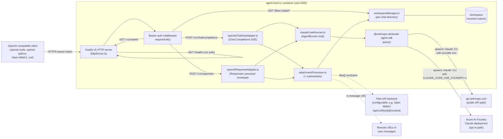
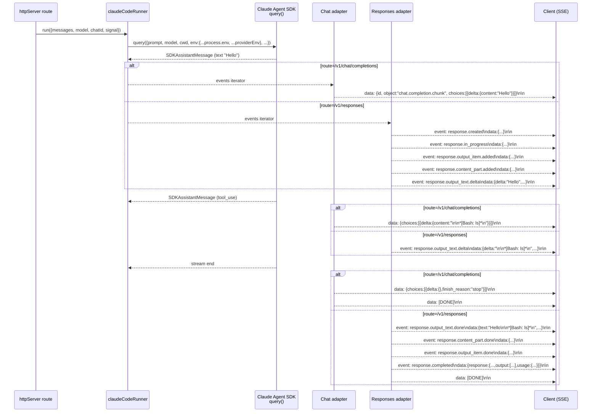

# Project Design — `agent-host-cc`

> **Status:** Authoritative technical design. Produced in Phase 5 of the workflow.
> **Authoritative inputs:**
> - `/Users/giorgosmarinos/aiwork/agent-host-cc/docs/design/refined-request.md` (User Confirmation 2026-05-10 block overrides everything below it).
> - `/Users/giorgosmarinos/aiwork/agent-host-cc/docs/design/plan-001-extract-and-rebrand.md`
> - `/Users/giorgosmarinos/aiwork/agent-host-cc/docs/design/plan-002-decouple-from-foundry.md`
> - `/Users/giorgosmarinos/aiwork/agent-host-cc/docs/design/plan-003-add-responses-api.md`
> - `/Users/giorgosmarinos/aiwork/agent-host-cc/docs/design/project-functions.md`
> - `/Users/giorgosmarinos/aiwork/agent-host-cc/docs/reference/codebase-scan-source-agent-host.md`
> - `/Users/giorgosmarinos/aiwork/agent-host-cc/docs/reference/investigation-extraction-approach.md`
> - `/Users/giorgosmarinos/aiwork/agent-host-cc/Issues - Pending Items.md` (DISC-1 supersedes the F-20 wording about `reasoning` items — see §5.5 below).
>
> **Audience:** Implementation engineers (human and Claude sub-agents), reviewers, future operators.

---

## 1. Overview

### 1.1 Statement

`agent-host-cc` is a self-contained, OpenAI-compatible HTTP host for the Anthropic Claude Code agent. It is delivered as a single OCI container image and exposes the agent through the canonical OpenAI surfaces — `POST /v1/chat/completions` (streaming SSE + non-streaming) and `POST /v1/responses` (streaming Responses event stream + non-streaming aggregate JSON) — plus `GET /v1/models`, `GET /healthz`, and `GET /files/:chatId/*path` for workspace artifact retrieval. It is intended for operators who want to drop the Claude Code agent behind any OpenAI-SDK-compatible client (Open WebUI, custom UIs, evaluation harnesses, the official `openai` Node/Python SDKs) without coupling the deployment to Open WebUI's container, to Azure AI Foundry, or to the upstream `open-webui-phase1` repository this project was extracted from.

### 1.2 Architectural goals

- **Standalone.** Zero build, runtime, or path linkage back to `/Users/giorgosmarinos/aiwork/open-webui-phase1/`. The project tree must continue to build and run after the source repository is renamed or removed (NF-1, AC-1).
- **OpenAI-compatible.** Both `/v1/chat/completions` (Chat Completions chunks ending with `data: [DONE]\n\n`) and `/v1/responses` (canonical Responses event envelope ending with `data: [DONE]\n\n`) are implemented to bit-level conformance with what the official `openai` Node SDK consumes (F-1, F-20, F-21, AC-16, AC-20).
- **Provider-agnostic.** The Anthropic public API is the default provider; Azure AI Foundry is opt-in via `CLAUDE_CODE_USE_FOUNDRY=1`. Exactly one provider resolves at startup; ambiguous or partial provider configuration causes a typed `ConfigurationError` and exit code 78. The discriminated union leaves room for Bedrock/Vertex arms in the future (F-13, AC-6, AC-7, FUT-7).
- **Container-native.** A multi-stage `node:22-alpine` Dockerfile producing a non-root image (`agent`, uid=1000) listening on the configured port, with a single writable mount target at `/workspace`. Buildable and runnable on Docker, Apple `container`, or any other OCI-compliant runtime without per-platform forking (F-18, AC-3).
- **No fallbacks for required configuration.** Missing required env vars raise a typed `ConfigurationError` and the process exits with code 78. Two intentional silent-default exceptions (`WORKSPACE_DIR=/workspace` and deterministic `chatId` derivation) are explicitly approved and registered in the project CLAUDE.md exception list (NF-3, AC-13). No other defaults are tolerated.

### 1.3 Non-goals (verbatim from refined-request "Out of scope")

The following are explicitly **out of scope** for v1:

- The `cc-monitor` sibling service from the source project (separate Electron/CLI dashboard with `dockerode`). A pointer file in `docs/reference/historical-context-cc-monitor.md` documents its existence and nothing more (D-3, CONFIRMED-3).
- The Open WebUI container, the Pipelines container, or any other phase-1 surrounding infrastructure.
- The Python `claude-skills` and `claude-artifact-server` containers that plan-002 of the source project retired.
- DB-stored Open WebUI configuration (`OPENAI_API_CONFIGS` etc.) — that is the consumer UI's concern, not ours.
- Stateful multi-turn agent sessions held in memory across HTTP requests. The per-`chatId` workspace persists on disk; no SDK session handle is held across requests.
- A Pipelines inlet filter (the source already retired this).
- Publishing the resulting image to a public container registry; build is local-only by default. Pushing remains an operator concern (CONFIRMED-4, FUT-6).
- Multiple `AgentRunner` implementations beyond `ClaudeCodeRunner`. The interface remains, only one implementation ships (FUT-4).
- Time-based workspace GC, an admin DELETE endpoint, per-chat file token gating (all carried as `Future`: FUT-1, FUT-2, FUT-3).
- Bedrock and Vertex provider arms (FUT-7).
- The future `RESPONSES_TOOL_USE_RENDERING=item` mode emitting native `function_call` items (FUT-5).

### 1.4 Out-of-scope re-confirmation: `/v1/responses`

The earlier draft of the refined request listed `/v1/responses` as out-of-scope. The User Confirmation block dated 2026-05-10 (CONFIRMED-2) **revoked** that restriction. `/v1/responses` is in scope for v1; the misnamed source file `openAiResponseAdapter.ts` (which actually emits Chat Completions chunks) is split into a correctly-named `openAiChatSseAdapter.ts` plus a freshly-authored `openAiResponseAdapter.ts` that emits the canonical Responses envelope (see §3 and plan-003).

---

## 2. System architecture

### 2.1 Component diagram (logical)



### 2.2 Request flow — `POST /v1/chat/completions`

```
Client → Fastify
  ↓
requireAuth(req)                       [401 unauthorized on miss]
  ↓
ChatCompletionRequestSchema.safeParse  [400 invalid_request on schema fail]
  ↓
stripModelPrefix(model, cfg.modelPrefix)
validateModel(model, cfg.modelIds)     [404 model_not_found on miss]
  ↓
deriveChatId(req.body.metadata?.chat_id, req.body)
  ↓
attachmentProcessor.process({chatId, messages, files})
   ├─ data: URLs → dataUrlDecoder → workspaceManager.write
   ├─ http(s): URLs → ssrfGuard → remoteUrlFetcher → workspaceManager.write
   ├─ files[] → filesApiFetcher (FILES_API_BASE_URL/PATH_TEMPLATE/KEY) → workspaceManager.write
   └─ in-message URLs → urlDetector → ssrfGuard → remoteUrlFetcher → workspaceManager.write
  ↓                                    [413 payload_too_large on cap; manifest line appended to last user message]
runner.run({messages, model, chatId, signal})  → returns AsyncIterable<SDKEvent>
  ↓
if (req.body.stream === false):
   aggregate via openAiChatSseAdapter.aggregate(events, header) → JSON Response
else:
   stream via openAiChatSseAdapter.adaptToOpenAiSse(events, header) → SSE frames
   …chunks…
   data: [DONE]\n\n
  ↓
[504 agent_timeout if AbortController fires; 502 agent_error on SDK error;
 mid-stream errors emit error chunk before [DONE]]
```

### 2.3 Request flow — `POST /v1/responses`

Identical pre-runner pipeline; only the surface mapping differs:

```
Client → Fastify → requireAuth → ResponsesRequestSchema.safeParse
                                  ↓
                         normalizeInput()  [string → single user message;
                                            array → as-is; input_image → image_url]
                                  ↓
                         attachmentProcessor.process(…)  [SAME as chat path]
                                  ↓
                         runner.run({…})  [SAME runner, SAME options]
                                  ↓
if (req.body.stream === false):
   aggregateResponses(events, header) → Response JSON object
else:
   adaptToOpenAiResponses(events, header) → SSE frames per §5.5
```

The single runner — `claudeCodeRunner.run()` — produces an `AsyncIterable<SDKEvent>` consumed by **either** adapter. The two adapters are mutually independent modules that share only the runner's event shape; they do not import each other.

### 2.4 Streaming pipeline diagram (SDK events fan out)



### 2.5 Container topology

```
┌────────────────────────────────────────────────────────────────┐
│ Host (Docker / Apple container / OCI runtime)                  │
│                                                                │
│   ┌──────────────────────────────────────────────────────┐     │
│   │ agent-host-cc:dev image (node:22-alpine)             │     │
│   │ - USER node (uid=1000, gid=1000)                    │     │
│   │ - WORKDIR /app                                       │     │
│   │ - /app/dist (compiled JS)                            │     │
│   │ - /app/node_modules (prod deps incl. SDK + native)   │     │
│   │ - EXPOSE 8000 (configurable via LISTEN_PORT)         │     │
│   │ - CMD ["node","dist/index.js"]                       │     │
│   │                                                      │     │
│   │   /workspace ←─── (writable mount target)            │     │
│   │   ├── <chatId-1>/                                    │     │
│   │   │   ├── image-abcd1234.png                         │     │
│   │   │   └── document-ef.pdf                            │     │
│   │   └── <chatId-2>/                                    │     │
│   │       └── ...                                        │     │
│   └──────────────────────────────────────────────────────┘     │
│                       ↑                                        │
│   .env  ────────►  env vars at startup                         │
│   (operator-managed; bind-mounted or `--env-file .env`)        │
│                                                                │
│   Volume: named volume OR bind mount;                          │
│           operator must `chown 1000:1000` on Linux hosts       │
│                                                                │
│   Single port exposed:  -p 8000:8000  (default)                │
└────────────────────────────────────────────────────────────────┘
```

The container is a **single-process** node service. There is no sidecar, no DB, no cache, no external state aside from the writable `/workspace` volume. Horizontal scale is out of scope for v1 (A-5) — the per-`chatId` workspace state is filesystem-local.

---

## 3. Module structure

All TypeScript sources live under `/Users/giorgosmarinos/aiwork/agent-host-cc/src/`. Imports use named ESM imports with explicit `.js` extensions (Node ≥ 22, `"moduleResolution": "bundler"` in `tsconfig.json`). No path aliases. Every stateful module is a factory function (`createX(...) → X`) returning a plain object — no classes.

### 3.1 `src/index.ts`

- **Path:** `/Users/giorgosmarinos/aiwork/agent-host-cc/src/index.ts`
- **Exports:** `main(): Promise<void>` (default-invoked under `if (import.meta.url === ... )`)
- **Responsibilities:**
  - Call `loadConfig(process.env)` → `Config`. On `ConfigurationError`, log the missing variable and `process.exit(78)`.
  - Emit `*_EXPIRES_AT` warnings via `warnIfNear(label, isoDate)` for: `AGENT_HOST_API_KEY_EXPIRES_AT`, `ANTHROPIC_API_KEY_EXPIRES_AT`, `ANTHROPIC_FOUNDRY_API_KEY_EXPIRES_AT`, `FILES_API_KEY_EXPIRES_AT`.
  - Log a startup line reporting the resolved provider kind (key/resource value never logged; presence only).
  - Construct `workspaceManager = createWorkspaceManager({...})`.
  - Construct `attachmentProcessor = createAttachmentProcessor({workspaceManager, baseUrl: cfg.filesApiBaseUrl, apiKey: cfg.filesApiKey, pathTemplate: cfg.filesApiPathTemplate, ...})`.
  - Construct `runner = createClaudeCodeRunner({provider: cfg.provider, agentTimeoutMs: cfg.agentTimeoutMs, agentMaxTurns: cfg.agentMaxTurns, ...})`.
  - Construct `app = await buildApp({cfg, workspaceManager, attachmentProcessor, runner})`.
  - `await app.listen({host: cfg.listenHost, port: cfg.listenPort})`.
- **Dependencies:** `./config.js`, `./workspaceManager.js`, `./attachmentProcessor.js`, `./claudeCodeRunner.js`, `./httpServer.js`, `./errors.js`.
- **Invoked from:** Container entrypoint `CMD ["node","dist/index.js"]`.

### 3.2 `src/httpServer.ts`

- **Path:** `/Users/giorgosmarinos/aiwork/agent-host-cc/src/httpServer.ts`
- **Exports:**
  - `buildApp(opts: HttpServerOptions): Promise<FastifyInstance>` — Fastify factory.
  - `HttpServerOptions` — `{cfg, workspaceManager, attachmentProcessor, runner}`.
  - (locals) `requireAuth(req, reply)`, `stripModelPrefix(m, prefix)`, `deriveChatId(metadataChatId | undefined, body)`.
- **Routes mounted:**
  - `GET /healthz` — no auth, returns `{ok:true}`.
  - `GET /v1/models` — bearer-auth, returns OpenAI list shape from `cfg.modelIds`.
  - `POST /v1/chat/completions` — bearer-auth → schema parse → strip prefix → derive chatId → attachment processing → runner → adapter `openAiChatSseAdapter` (streaming or aggregate).
  - `POST /v1/responses` — bearer-auth → schema parse → normalize input → strip prefix → derive chatId → attachment processing → runner → adapter `openAiResponseAdapter` (streaming or aggregate).
  - `GET /files/:chatId/*path` — bearer-auth → path traversal check → stream file from `<workspaceDir>/<chatId>/<path>` with `application/octet-stream`.
- **Error handling:** Single Fastify error handler that recognizes `AgentHostError` subclasses and serializes via `err.toErrorEnvelope()`; Fastify-native errors (e.g. `FST_ERR_CTP_BODY_TOO_LARGE`) are translated into `PayloadTooLargeError` with proper HTTP status. Mid-stream errors during SSE emit a final error chunk before `[DONE]\n\n`.
- **Body limit:** `bodyLimit: cfg.bodyLimitBytes` (default 64 MB) per NF-6.
- **Logging:** Pino via Fastify built-in logger; `redact: ["req.headers.authorization", "req.body.messages[*].content[*].image_url.url", ...]` (truncate base64 image bodies > 1 KB).
- **Dependencies:** `fastify`, `./config.js`, `./types.js`, `./errors.js`, `./agentRunner.js`, `./workspaceManager.js`, `./attachmentProcessor.js`, `./openAiChatSseAdapter.js`, `./openAiResponseAdapter.js`, `node:crypto`.
- **Invoked from:** `src/index.ts`.

### 3.3 `src/config.ts`

- **Path:** `/Users/giorgosmarinos/aiwork/agent-host-cc/src/config.ts`
- **Exports:**
  - `Config` (interface) — see §4.1 for the full shape.
  - `Provider` (discriminated union) — see §4.1.
  - `loadConfig(env?: NodeJS.ProcessEnv): Config` — pure function; throws `ConfigurationError` on missing required variables; never reads secrets through `process.env` directly (env is injected as an argument, default `process.env`).
  - (local) `required(env, key): string` — throws `ConfigurationError(key)` if `env[key]` is empty/undefined.
  - (local) `parseInt(env, key, default)` — bounded integer parsing.
- **Provider selection logic (per plan-002 Phase A.2):**
  - If `env.CLAUDE_CODE_USE_FOUNDRY === "1"`:
    - require `ANTHROPIC_FOUNDRY_API_KEY` and `ANTHROPIC_FOUNDRY_RESOURCE` → `provider = {kind:"anthropic-foundry", apiKey, resource}`.
  - Else:
    - require `ANTHROPIC_API_KEY` → `provider = {kind:"anthropic-public", apiKey}`.
  - If `ANTHROPIC_API_KEY` AND Foundry trio are all present but `CLAUDE_CODE_USE_FOUNDRY` is not `"1"`, log INFO "Foundry credentials present but CLAUDE_CODE_USE_FOUNDRY != '1' — using Anthropic public API".
- **Dependencies:** `./errors.js` (`ConfigurationError`), `node:fs/promises` (none — pure), `pino` (none — caller logs).
- **Invoked from:** `src/index.ts`.

### 3.4 `src/errors.ts`

- **Path:** `/Users/giorgosmarinos/aiwork/agent-host-cc/src/errors.ts`
- **Exports:**
  - `AgentHostError` (abstract base; `httpStatus`, `errorType`, `toErrorEnvelope(): ErrorEnvelope`).
  - `ConfigurationError(missingKey: string)` — exit 78, but NOT an HTTP error.
  - `UnauthorizedError` — 401, `unauthorized`.
  - `InvalidRequestError(detail: ZodIssue[] | string)` — 400, `invalid_request`.
  - `ModelNotFoundError(model: string)` — 404, `model_not_found`.
  - `PayloadTooLargeError({limitBytes, currentBytes})` — 413, `payload_too_large`.
  - `UpstreamFilesFetchError({fileId, status?, cause?})` — 502, `upstream_files_fetch_failed`.
  - `UpstreamUrlFetchError({url, status?, cause?})` — 502, `upstream_url_fetch_failed`.
  - `UnsafeUrlError({url, reason})` — 400, `unsafe_url`.
  - `AgentRunError(cause: Error)` — 502, `agent_error`.
  - `AgentTimeoutError(timeoutMs: number)` — 504, `agent_timeout`.
  - `ErrorEnvelope` (TS type, see §4.7).
- **Dependencies:** none (no imports from project modules).
- **Invoked from:** every module that surfaces errors; `httpServer.ts` is the central serializer.

### 3.5 `src/types.ts`

- **Path:** `/Users/giorgosmarinos/aiwork/agent-host-cc/src/types.ts`
- **Exports:**
  - `ChatCompletionRequestSchema` (Zod) and inferred `ChatCompletionRequest` (TS type).
  - `ResponsesRequestSchema` (Zod) and inferred `ResponsesRequest` (TS type) — added by plan-003 Phase 4.
  - `Message`, `ContentPart`, `FileRef`, `AttachmentManifest` (Zod schemas + types).
  - `InputMessage`, `InputContentPart` (Responses-flavored types).
  - Helper `normalizeInput(input: ResponsesRequest["input"]): Message[]` — converts Responses `input` to the same internal `Message[]` shape used by the Chat path.
- **Zod conventions:**
  - Uses Zod v4 API (`z.looseObject(...)`, not v3's `.passthrough()`).
  - Every external request body is parsed with `.safeParse`; failures map to `InvalidRequestError(result.error.issues)`.
  - `image_url` parts accept both string and `{url:string}` shapes; `input_image` parts likewise.
- **Dependencies:** `zod`.
- **Invoked from:** `httpServer.ts` (route handlers), `attachmentProcessor.ts` (consumes `Message[]`), test/unit/types.test.ts.

### 3.6 `src/agentRunner.ts`

- **Path:** `/Users/giorgosmarinos/aiwork/agent-host-cc/src/agentRunner.ts`
- **Exports:**
  - `interface AgentRunner { run(req: RunRequest): AsyncIterable<unknown>; }` — the iterator yields raw SDK events; adapters interpret them.
  - `interface RunRequest { messages: Message[]; model: string; chatId: string; signal?: AbortSignal; }`
- **Dependencies:** `./types.js`.
- **Invoked from:** `httpServer.ts` (consumer) and `claudeCodeRunner.ts` (implementer).

### 3.7 `src/claudeCodeRunner.ts`

- **Path:** `/Users/giorgosmarinos/aiwork/agent-host-cc/src/claudeCodeRunner.ts`
- **Exports:**
  - `createClaudeCodeRunner(opts: ClaudeCodeRunnerOptions): AgentRunner`
  - `interface ClaudeCodeRunnerOptions { provider: Provider; agentTimeoutMs: number; agentMaxTurns: number; workspaceDir: string; }`
  - (local) `resolveClaudeExecutable(): string | undefined` — tries the bundled musl native package first, then glibc; returns the absolute path or `undefined` (lets the SDK fall back to its own auto-detection).
- **Per-call logic:**
  - Construct `cwd = path.join(opts.workspaceDir, sanitizedChatId)` (workspace already exists thanks to attachment processing).
  - Build `providerEnv` per provider.kind (see ADR-5 in §10).
  - `const env = { ...process.env, ...providerEnv };` — explicit spread mitigates SDK v0.2.113 replace-semantics revert.
  - Construct `AbortController` with `setTimeout(() => abortController.abort(new AgentTimeoutError(opts.agentTimeoutMs)), opts.agentTimeoutMs)`.
  - Convert internal `Message[]` to the SDK's `prompt` shape (system messages → `systemPrompt` override; user/assistant turns → `prompt` array).
  - Call `query({prompt, options: {model, cwd, env, maxTurns: opts.agentMaxTurns, abortController, tools: {type:"preset", preset:"claude_code"}, systemPrompt: {type:"preset", preset:"claude_code"}, settingSources: ["project"], permissionMode: "bypassPermissions", allowDangerouslySkipPermissions: true, pathToClaudeCodeExecutable: resolveClaudeExecutable()}})`.
  - Return the SDK's async iterator directly; surface `AgentTimeoutError` from the abort signal and `AgentRunError(cause)` from any other thrown error.
- **Dependencies:** `@anthropic-ai/claude-agent-sdk`, `./agentRunner.js`, `./config.js` (for `Provider` type), `./errors.js`, `./types.js`, `node:path`, `node:module` (`createRequire`).
- **Invoked from:** `src/index.ts`.

### 3.8 `src/openAiChatSseAdapter.ts` (renamed from `openAiResponseAdapter.ts`)

- **Path:** `/Users/giorgosmarinos/aiwork/agent-host-cc/src/openAiChatSseAdapter.ts`
- **Renamed from:** `src/openAiResponseAdapter.ts` (per plan-003 Phase 1; the original file's content emits Chat Completions SSE chunks despite the misleading source name).
- **Exports:**
  - `interface SseHeader { id: string; model: string; created: number; }`
  - `async function* adaptToOpenAiSse(events: AsyncIterable<unknown>, header: SseHeader): AsyncIterable<string>` — yields SSE-framed strings (`data: <JSON>\n\n` … `data: [DONE]\n\n`).
  - `async function aggregateChat(events: AsyncIterable<unknown>, header: SseHeader): Promise<unknown>` — non-streaming aggregator returning a `chat.completion` JSON object.
- **Behavior (per F-14):**
  - For every SDK assistant `text` block delta → emit `chat.completion.chunk` with `choices[0].delta.content = text`.
  - For every SDK assistant `tool_use` block → emit `chat.completion.chunk` with `choices[0].delta.content = "\n\n*[<tool_name>: <truncated_input>]*\n"`.
  - On normal stream end → emit final chunk with `choices[0].delta = {}`, `finish_reason = "stop"`.
  - Mid-stream error → emit error chunk with `choices[0].delta = {}, finish_reason = "stop"` and an error envelope-style fragment in the chunk's metadata; never silently truncate.
  - `finally` → always yield `data: [DONE]\n\n`.
- **Dependencies:** `./errors.js`, `./types.js`.
- **Invoked from:** `httpServer.ts` (`POST /v1/chat/completions` handler).

### 3.9 `src/openAiResponseAdapter.ts` (NEW — Responses API impl)

- **Path:** `/Users/giorgosmarinos/aiwork/agent-host-cc/src/openAiResponseAdapter.ts`
- **Created by:** plan-003 Phase 2.
- **Exports:**
  - `interface ResponsesHeader { id: string; model: string; created: number; }`
  - `async function* adaptToOpenAiResponses(events: AsyncIterable<unknown>, header: ResponsesHeader): AsyncIterable<string>` — yields SSE frames per the canonical sequence in §5.5.
  - `async function aggregateResponses(events: AsyncIterable<unknown>, header: ResponsesHeader): Promise<unknown>` — internally consumes `adaptToOpenAiResponses` and returns the final `Response` JSON object (single source of truth; no parallel implementation per ADR-3).
- **Behavior:** see §5.5 and ADR-3, ADR-4. Per-request monotonic `sequence_number`; per-message `item_id = "msg_<cryptoRandomId>"`.
- **Dependencies:** `./errors.js`, `./types.js`, `./config.js` (for `RESPONSES_TOOL_USE_RENDERING` flag check), `node:crypto`.
- **Invoked from:** `httpServer.ts` (`POST /v1/responses` handler).

### 3.10 `src/attachmentProcessor.ts` (orchestrator)

- **Path:** `/Users/giorgosmarinos/aiwork/agent-host-cc/src/attachmentProcessor.ts`
- **Exports:**
  - `createAttachmentProcessor(opts: AttachmentProcessorOptions): AttachmentProcessor`
  - `interface AttachmentProcessorOptions { workspaceManager, baseUrl, apiKey, pathTemplate, maxInlineImageBytes, maxRemoteFetchBytes, maxUrlFetchesPerTurn, urlFetchTimeoutMs, ssrfBypass?: boolean }`
  - `interface AttachmentProcessor { process(input: ProcessInput): Promise<ProcessOutput>; }`
  - `interface ProcessInput { chatId: string; messages: Message[]; files?: FileRef[]; }`
  - `interface ProcessOutput { messages: Message[]; manifest: AttachmentManifestEntry[]; }`
- **Per-call logic:**
  1. For each `image_url` content part:
     - If `data:` URL → `dataUrlDecoder.decodeDataUrl` → `workspaceManager.write` → if MIME starts with `image/` AND bytes ≤ `maxInlineImageBytes`, keep inline as Anthropic image block; else, drop the inline part and add a manifest entry.
     - If `http(s):` URL → `ssrfGuard.assertSafeUrl` → `remoteUrlFetcher.fetchRemoteUrl` → `workspaceManager.write` → manifest entry.
  2. For each `files[]` entry → `filesApiFetcher.fetchFromFilesApi(id, {baseUrl, apiKey, pathTemplate})` → `workspaceManager.write` → manifest entry. Fetch failures swallowed per-entry (do not abort the turn) but logged at WARN.
  3. Run `urlDetector.extractUrls` on each user-message text body, dedup, cap at `maxUrlFetchesPerTurn`, fetch each via `ssrfGuard` + `remoteUrlFetcher`, append per-URL entries to the manifest.
  4. Append a single manifest line to the **last user message text** describing every file added during this turn (one human-readable bullet per file).
- **Dependencies:** `./types.js`, `./workspaceManager.js`, `./errors.js`, `./attachmentProcessor/dataUrlDecoder.js`, `./attachmentProcessor/ssrfGuard.js`, `./attachmentProcessor/remoteUrlFetcher.js`, `./attachmentProcessor/filesApiFetcher.js`, `./attachmentProcessor/urlDetector.js`.
- **Invoked from:** `httpServer.ts` (both Chat and Responses route handlers).

### 3.11 `src/attachmentProcessor/dataUrlDecoder.ts`

- **Path:** `/Users/giorgosmarinos/aiwork/agent-host-cc/src/attachmentProcessor/dataUrlDecoder.ts`
- **Exports:** `decodeDataUrl(s: string): DecodedDataUrl`, `isDataUrl(s: string): boolean`, `interface DecodedDataUrl { mime: string; bytes: Buffer; ext: string; }`.
- **Behavior:** Parse `data:<mime>;base64,<payload>`; decode base64; map MIME → file extension via a built-in table (`image/png` → `.png`, `application/pdf` → `.pdf`, …); return both.
- **Dependencies:** `node:buffer`.
- **Invoked from:** `attachmentProcessor.ts`, unit tests.

### 3.12 `src/attachmentProcessor/ssrfGuard.ts`

- **Path:** `/Users/giorgosmarinos/aiwork/agent-host-cc/src/attachmentProcessor/ssrfGuard.ts`
- **Exports:** `assertSafeUrl(url: string): Promise<void>` — throws `UnsafeUrlError` on:
  - non-`http`/`https` scheme,
  - hostname resolves (DNS) to any IP in `127.0.0.0/8`, `10.0.0.0/8`, `172.16.0.0/12`, `192.168.0.0/16`, `169.254.0.0/16`, `::1`, `fc00::/7`, `fe80::/10`.
- **Dependencies:** `node:dns/promises`, `node:net`.
- **Invoked from:** `attachmentProcessor.ts` (via `remoteUrlFetcher`).

### 3.13 `src/attachmentProcessor/remoteUrlFetcher.ts`

- **Path:** `/Users/giorgosmarinos/aiwork/agent-host-cc/src/attachmentProcessor/remoteUrlFetcher.ts`
- **Exports:** `fetchRemoteUrl(url, opts): Promise<FetchedRemote>`, `interface FetchOptions { maxBytes; timeoutMs; ssrfBypass?: boolean; }`, `interface FetchedRemote { url; mime; bytes: Buffer; ext: string; }`.
- **Behavior:** call `assertSafeUrl(url)` unless `ssrfBypass` (test only); use `undici.request` with timeout; stream-cap at `maxBytes` (throws `UpstreamUrlFetchError` if exceeded); read `content-type` to derive ext.
- **Dependencies:** `undici`, `./ssrfGuard.js`, `../errors.js`.
- **Invoked from:** `attachmentProcessor.ts`.

### 3.14 `src/attachmentProcessor/filesApiFetcher.ts`

- **Path:** `/Users/giorgosmarinos/aiwork/agent-host-cc/src/attachmentProcessor/filesApiFetcher.ts`
- **Exports:** `fetchFromFilesApi(id: string, opts: FilesApiOptions): Promise<FetchedFile>` (renamed from `fetchFromOpenWebUiFiles` per plan-001 Phase B.3), `interface FilesApiOptions { baseUrl: string; apiKey: string; pathTemplate: string; maxBytes: number; timeoutMs: number; }`, `interface FetchedFile { id; filename; mime; bytes: Buffer; ext: string; }`.
- **Behavior:** Construct URL as `baseUrl + pathTemplate.replace("{id}", encodeURIComponent(id))`; bearer-auth with `apiKey`; stream-cap at `maxBytes`; throws `UpstreamFilesFetchError({fileId: id, status, cause})` on non-2xx.
- **Dependencies:** `undici`, `../errors.js`.
- **Invoked from:** `attachmentProcessor.ts`.

### 3.15 `src/attachmentProcessor/urlDetector.ts`

- **Path:** `/Users/giorgosmarinos/aiwork/agent-host-cc/src/attachmentProcessor/urlDetector.ts`
- **Exports:** `extractUrls(text: string): string[]` — strips fenced code blocks (\`\`\`…\`\`\`) and inline code (\`…\`) regions first, then matches a conservative `https?://` regex. Dedupes preserving order.
- **Dependencies:** none.
- **Invoked from:** `attachmentProcessor.ts`.

### 3.16 `src/workspaceManager.ts`

- **Path:** `/Users/giorgosmarinos/aiwork/agent-host-cc/src/workspaceManager.ts`
- **Exports:**
  - `createWorkspaceManager(opts: WorkspaceManagerOptions): WorkspaceManager`
  - `interface WorkspaceManagerOptions { rootDir: string; maxBytesPerChat: number; }`
  - `interface WorkspaceManager { write(chatId, suggestedFilename, bytes): Promise<WorkspaceFile>; resolve(chatId, relPath): string; sanitizeChatId(s): string; sanitizeFilename(s): string; getChatBytes(chatId): Promise<number>; evictOldestUntil(chatId, freeBytes): Promise<void>; }`
  - `interface WorkspaceFile { absolutePath: string; relativePath: string; sha256: string; bytes: number; }`
- **Filename sanitization rules (per F-11):**
  - Reject `..`, absolute paths, NUL/control chars; truncate to 200 chars; preserve extension.
  - `chatId` sanitization: alphanumeric + `-` + `_`; collapse other characters to `-`; truncate to 100 chars.
- **Deduplication / collision (per F-11):**
  - sha-256 of bytes; if a file with the same final filename already exists, hash-compare; if identical → reuse (idempotent), if different → suffix `-<sha[:8]>` before extension and retry.
- **Cap enforcement (per F-11, AC-11):**
  - Before writing, sum existing chat dir bytes + incoming bytes; if over `maxBytesPerChat` → throw `PayloadTooLargeError({limitBytes, currentBytes})` (the route handler returns 413).
  - `evictOldestUntil(chatId, freeBytes)` walks the chat dir by `mtime` ascending and unlinks files until at least `freeBytes` are free; exposed by API but not auto-triggered in v1 (FUT-3).
- **Path traversal:** `resolve(chatId, relPath)` returns `path.resolve(rootDir, sanitizeChatId(chatId), relPath)`; the route handler must verify the resolved path starts with `path.resolve(rootDir, sanitizedChatId) + path.sep`. If not → `InvalidRequestError`.
- **Dependencies:** `node:fs/promises`, `node:path`, `node:crypto`.
- **Invoked from:** `attachmentProcessor.ts` (writes), `httpServer.ts` (`GET /files/:chatId/*path` reads), `index.ts` (construction).

### 3.17 `src/attachmentProcessor/` directory layout summary

```
/Users/giorgosmarinos/aiwork/agent-host-cc/src/attachmentProcessor/
├── dataUrlDecoder.ts
├── ssrfGuard.ts
├── remoteUrlFetcher.ts
├── filesApiFetcher.ts
└── urlDetector.ts
```

The orchestrator `src/attachmentProcessor.ts` imports each by its named export; the submodule directory is colocated with its parent file by convention.

---

## 4. Data models

### 4.1 `Config` and `Provider`

```ts
// src/config.ts

export type Provider =
  | { kind: "anthropic-public"; apiKey: string }
  | { kind: "anthropic-foundry"; apiKey: string; resource: string };

export interface Config {
  // Required-always
  agentHostApiKey: string;
  modelIds: string[];                            // CSV-parsed

  // Provider (discriminated; exactly one resolves)
  provider: Provider;

  // Files API (formerly OPENWEBUI_*)
  filesApiBaseUrl: string;
  filesApiKey: string;
  filesApiPathTemplate: string;                  // default "/api/v1/files/{id}/content"

  // HTTP server
  listenHost: string;                            // default "0.0.0.0"
  listenPort: number;                            // default 8000
  bodyLimitBytes: number;                        // default 67_108_864 (64 MB)

  // Workspace
  workspaceDir: string;                          // default "/workspace" (silent default — exception #1)
  workspaceMaxBytesPerChat: number;              // default 209_715_200 (200 MB)
  maxInlineImageBytes: number;                   // default 20_971_520 (20 MB)
  maxRemoteFetchBytes: number;                   // default 52_428_800 (50 MB)
  maxUrlFetchesPerTurn: number;                  // default 5

  // Agent
  agentTimeoutMs: number;                        // default 300_000 (5 min)
  agentMaxTurns: number;                         // default 20
  modelPrefix: string;                           // default "cc."
  responsesToolUseRendering: "text" | "item";    // default "text"; "item" reserved (throws ConfigurationError in v1)

  // URL fetching
  urlFetchTimeoutMs: number;                     // default 30_000

  // Logging
  logLevel: "fatal"|"error"|"warn"|"info"|"debug"|"trace"; // default "info"

  // Expiry warnings (optional ISO-8601)
  agentHostApiKeyExpiresAt?: string;
  anthropicApiKeyExpiresAt?: string;
  anthropicFoundryApiKeyExpiresAt?: string;
  filesApiKeyExpiresAt?: string;
}
```

### 4.2 `ChatCompletionsRequest` (Zod)

```ts
// src/types.ts

export const ContentPartSchema = z.discriminatedUnion("type", [
  z.object({ type: z.literal("text"), text: z.string() }),
  z.object({
    type: z.literal("image_url"),
    image_url: z.union([
      z.string(),                                       // string form
      z.object({ url: z.string(), detail: z.string().optional() }),
    ]),
  }),
]);

export const MessageSchema = z.object({
  role: z.enum(["system", "user", "assistant"]),
  content: z.union([z.string(), z.array(ContentPartSchema)]),
});

export const FileRefSchema = z.object({
  id: z.string(),
  filename: z.string().optional(),
  // OW-style passthrough fields are tolerated via z.looseObject downstream
});

export const ChatCompletionRequestSchema = z.looseObject({
  model: z.string(),
  messages: z.array(MessageSchema).min(1),
  stream: z.boolean().optional().default(false),
  temperature: z.number().optional(),
  top_p: z.number().optional(),
  max_tokens: z.number().int().positive().optional(),
  metadata: z.object({ chat_id: z.string().optional() }).optional(),
  files: z.array(FileRefSchema).optional(),
});

export type ChatCompletionRequest = z.infer<typeof ChatCompletionRequestSchema>;
export type Message = z.infer<typeof MessageSchema>;
export type ContentPart = z.infer<typeof ContentPartSchema>;
export type FileRef = z.infer<typeof FileRefSchema>;
```

### 4.3 `ResponsesRequest` (Zod) — added by plan-003

```ts
// src/types.ts

export const InputContentPartSchema = z.discriminatedUnion("type", [
  z.object({ type: z.literal("input_text"), text: z.string() }),
  z.object({
    type: z.literal("input_image"),
    image_url: z.union([z.string(), z.object({ url: z.string() })]),
  }),
]);

export const InputMessageSchema = z.object({
  role: z.enum(["system", "user", "assistant"]),
  content: z.array(InputContentPartSchema),
});

export const ResponsesRequestSchema = z.looseObject({
  model: z.string(),
  input: z.union([z.string(), z.array(InputMessageSchema)]),
  stream: z.boolean().optional().default(true),       // default differs from Chat
  temperature: z.number().optional(),
  top_p: z.number().optional(),
  max_output_tokens: z.number().int().positive().optional(),
  metadata: z.object({ chat_id: z.string().optional() }).optional(),
  files: z.array(FileRefSchema).optional(),
});

export type ResponsesRequest = z.infer<typeof ResponsesRequestSchema>;
export type InputMessage = z.infer<typeof InputMessageSchema>;
export type InputContentPart = z.infer<typeof InputContentPartSchema>;
```

### 4.4 `AttachmentManifestEntry`

```ts
// src/types.ts

export interface AttachmentManifestEntry {
  source: "data-url" | "remote-url" | "files-api" | "in-message-url";
  origin: string;            // original URL or files[] id
  filename: string;          // sanitized name within the chat workspace
  relativePath: string;      // <chatId>/<filename>
  bytes: number;
  mime: string;
  sha256: string;
  inline: boolean;           // true iff kept inline as an Anthropic image block
}
```

### 4.5 `WorkspaceFile`

```ts
// src/workspaceManager.ts

export interface WorkspaceFile {
  absolutePath: string;      // e.g. /workspace/<chatId>/image-abc.png
  relativePath: string;      // e.g. <chatId>/image-abc.png
  sha256: string;
  bytes: number;
}
```

The chat-directory naming convention is fixed: `<WORKSPACE_DIR>/<sanitized chatId>/<sanitized filename>`. Filename sanitization rules in §3.16. `chatId` derivation for requests missing `metadata.chat_id` is documented in §6.5 as the second silent-default exception.

### 4.6 `ErrorEnvelope`

```ts
// src/errors.ts

export interface ErrorEnvelope {
  error: {
    type: string;            // e.g. "unauthorized", "invalid_request", "agent_timeout"
    message: string;
    [key: string]: unknown;  // optional details (limitBytes, currentBytes, missingKey, etc.)
  };
}
```

Each `AgentHostError` subclass implements `toErrorEnvelope(): ErrorEnvelope`. The single Fastify error handler in `httpServer.ts` recognizes the base class and serializes using `err.httpStatus` and `err.toErrorEnvelope()`.

### 4.7 No database in v1

There is **no DB**. All persistent state is filesystem-backed under the configured `WORKSPACE_DIR` (default `/workspace`). The chat directory naming pattern is `<WORKSPACE_DIR>/<sanitized chatId>/<sanitized filename>`. No additional indexes, no migrations, no ORM. Horizontal scale and shared workspace storage are out of scope for v1 (A-5).

---

## 5. HTTP API contracts

All routes except `GET /healthz` require `Authorization: Bearer <AGENT_HOST_API_KEY>` (F-5). All response bodies — including errors — are `application/json` unless the route is streaming SSE. The Fastify body limit is `cfg.bodyLimitBytes` (default 64 MB, NF-6).

### 5.1 `GET /healthz`

| Field | Value |
|---|---|
| Auth | None |
| Method | `GET` |
| Path | `/healthz` |
| Request body | (none) |
| Success response | HTTP 200, `{"ok": true}` |
| Error responses | (none — always 200) |

### 5.2 `GET /v1/models`

| Field | Value |
|---|---|
| Auth | Bearer required |
| Method | `GET` |
| Path | `/v1/models` |
| Request body | (none) |
| Success response | HTTP 200, body `{ "object":"list", "data":[{"id":"<modelId>","object":"model","created":<unix>,"owned_by":"agent-host-cc"}, …] }` populated from `cfg.modelIds`. |
| Error responses | 401 `unauthorized` if header missing/wrong. |

### 5.3 `POST /v1/chat/completions`

| Field | Value |
|---|---|
| Auth | Bearer required |
| Method | `POST` |
| Path | `/v1/chat/completions` |
| Request schema | `ChatCompletionRequestSchema` (§4.2). |
| Success — streaming (`stream:true`) | `Content-Type: text/event-stream`. Sequence of `data: <chat.completion.chunk JSON>\n\n` lines, terminating with `data: [DONE]\n\n`. Each chunk follows the OpenAI `chat.completion.chunk` shape: `{id, object:"chat.completion.chunk", created, model, choices:[{index:0, delta:{content?:string}, finish_reason?:string|null}]}`. |
| Success — non-streaming (`stream:false`) | HTTP 200, body shape `{id, object:"chat.completion", created, model, choices:[{index:0, message:{role:"assistant", content:string}, finish_reason:"stop"}], usage:{prompt_tokens, completion_tokens, total_tokens}}`. |
| Error 400 `invalid_request` | Zod parse failure or path traversal in workspace ref. |
| Error 401 `unauthorized` | Missing/wrong bearer. |
| Error 404 `model_not_found` | Model not in `cfg.modelIds` after prefix strip. |
| Error 413 `payload_too_large` | Body > `cfg.bodyLimitBytes`, OR workspace cap hit during attachment processing (`{limitBytes, currentBytes}` in envelope). |
| Error 502 `upstream_files_fetch_failed` | Files API non-2xx. |
| Error 502 `upstream_url_fetch_failed` | Remote URL fetch non-2xx or byte cap hit. |
| Error 400 `unsafe_url` | SSRF guard rejected. |
| Error 502 `agent_error` | SDK threw a non-timeout error. |
| Error 504 `agent_timeout` | `AbortController` fired on `cfg.agentTimeoutMs`. |
| Error 500 `internal` | Uncaught exception (last-resort handler). |

**Mid-stream-error contract (per F-14 and §7):** when an error occurs after the first SSE byte has been written, the adapter MUST emit a final `chat.completion.chunk` carrying an embedded error envelope, then `data: [DONE]\n\n`. The HTTP status line is already 200 at this point, so the error is signalled in-band.

### 5.4 `GET /files/:chatId/*path`

| Field | Value |
|---|---|
| Auth | Bearer required |
| Method | `GET` |
| Path | `/files/:chatId/*path` |
| Request body | (none) |
| Success response | HTTP 200, `Content-Type: application/octet-stream`, body = file contents from `<workspaceDir>/<sanitized chatId>/<sanitized path>`. |
| Error 400 `invalid_request` | `..` or absolute path in `*path`; resolved path escapes the chat directory. |
| Error 401 `unauthorized` | Missing/wrong bearer. |
| Error 404 (no envelope) | File not found OR resolved path is not a regular file. |

### 5.5 `POST /v1/responses`

| Field | Value |
|---|---|
| Auth | Bearer required |
| Method | `POST` |
| Path | `/v1/responses` |
| Request schema | `ResponsesRequestSchema` (§4.3). `input` may be a string or an array of `InputMessage`. |
| Success — non-streaming (`stream:false`) | HTTP 200, body shape `{id:"resp_…", object:"response", status:"completed", created_at, model, output:[…], usage:{…}}`. |
| Success — streaming (`stream:true`, default) | `Content-Type: text/event-stream`. Canonical event sequence below. Terminates with `data: [DONE]\n\n`. |
| Error 400 `invalid_request` | Zod parse failure (including invalid `input_image.image_url` shape). |
| Error 401 `unauthorized` | Missing/wrong bearer. |
| Error 404 `model_not_found` | Model not in `cfg.modelIds` after prefix strip. |
| Error 413 `payload_too_large` | Same as Chat. |
| Error 502 `upstream_files_fetch_failed` | Same as Chat. |
| Error 502 `upstream_url_fetch_failed` | Same as Chat. |
| Error 400 `unsafe_url` | Same as Chat. |
| Error 502 `agent_error` | Same as Chat. |
| Error 504 `agent_timeout` | Same as Chat. |

**Canonical streaming sequence (per plan-003 Phase 2 and Investigation Focus Area 2 Option 2A):**

```
event: response.created
event: response.in_progress
event: response.output_item.added
event: response.content_part.added
event: response.output_text.delta              ← repeats per text chunk
event: response.output_text.delta
…
event: response.output_text.done
event: response.content_part.done
event: response.output_item.done
event: response.completed
data: [DONE]\n\n
```

Each event is two SSE lines:

```
event: <event-type>\n
data: <JSON payload>\n\n
```

**Per-event payload examples** (`<id>` placeholder values are illustrative; in practice `id` is `"resp_<cryptoRandomId>"` and `item_id` is `"msg_<cryptoRandomId>"`):

#### `response.created`

```json
{
  "type": "response.created",
  "response": {
    "id": "resp_abc123",
    "object": "response",
    "status": "in_progress",
    "model": "claude-sonnet-4-6",
    "created_at": 1746835200,
    "output": [],
    "usage": null
  },
  "sequence_number": 0
}
```

#### `response.in_progress`

```json
{
  "type": "response.in_progress",
  "response": {
    "id": "resp_abc123",
    "object": "response",
    "status": "in_progress",
    "model": "claude-sonnet-4-6",
    "created_at": 1746835200,
    "output": [],
    "usage": null
  },
  "sequence_number": 1
}
```

#### `response.output_item.added`

```json
{
  "type": "response.output_item.added",
  "output_index": 0,
  "item": {
    "id": "msg_def456",
    "type": "message",
    "role": "assistant",
    "content": []
  },
  "sequence_number": 2
}
```

#### `response.content_part.added`

```json
{
  "type": "response.content_part.added",
  "item_id": "msg_def456",
  "output_index": 0,
  "content_index": 0,
  "part": { "type": "output_text", "text": "" },
  "sequence_number": 3
}
```

#### `response.output_text.delta`

```json
{
  "type": "response.output_text.delta",
  "item_id": "msg_def456",
  "output_index": 0,
  "content_index": 0,
  "delta": "Hello",
  "sequence_number": 4
}
```

For **tool_use** rendering (per ADR-4 / DISC-1 / Investigation Option 4A), the SDK's `tool_use` block is rendered as another `output_text.delta` on the same `(item_id, content_index)`:

```json
{
  "type": "response.output_text.delta",
  "item_id": "msg_def456",
  "output_index": 0,
  "content_index": 0,
  "delta": "\n\n*[Bash: ls -la]*\n",
  "sequence_number": 5
}
```

#### `response.output_text.done`

```json
{
  "type": "response.output_text.done",
  "item_id": "msg_def456",
  "output_index": 0,
  "content_index": 0,
  "text": "Hello\n\n*[Bash: ls -la]*\n",
  "sequence_number": 6
}
```

#### `response.content_part.done`

```json
{
  "type": "response.content_part.done",
  "item_id": "msg_def456",
  "output_index": 0,
  "content_index": 0,
  "part": { "type": "output_text", "text": "Hello\n\n*[Bash: ls -la]*\n" },
  "sequence_number": 7
}
```

#### `response.output_item.done`

```json
{
  "type": "response.output_item.done",
  "output_index": 0,
  "item": {
    "id": "msg_def456",
    "type": "message",
    "role": "assistant",
    "content": [
      { "type": "output_text", "text": "Hello\n\n*[Bash: ls -la]*\n" }
    ]
  },
  "sequence_number": 8
}
```

#### `response.completed`

```json
{
  "type": "response.completed",
  "response": {
    "id": "resp_abc123",
    "object": "response",
    "status": "completed",
    "model": "claude-sonnet-4-6",
    "created_at": 1746835200,
    "output": [
      {
        "id": "msg_def456",
        "type": "message",
        "role": "assistant",
        "content": [
          { "type": "output_text", "text": "Hello\n\n*[Bash: ls -la]*\n" }
        ]
      }
    ],
    "usage": { "input_tokens": 12, "output_tokens": 8, "total_tokens": 20 }
  },
  "sequence_number": 9
}
```

#### Stream terminator

```
data: [DONE]\n\n
```

(Plain SSE data line, no `event:` prefix — matches OpenAI's own server output and the Chat Completions adapter for symmetry.)

#### Mid-stream-error handling

If the runner throws after the envelope events have started, the adapter emits:

```json
{
  "type": "response.failed",
  "response": {
    "id": "resp_abc123",
    "object": "response",
    "status": "failed",
    "model": "claude-sonnet-4-6",
    "created_at": 1746835200,
    "output": [],
    "error": { "code": "agent_error", "message": "<error message>" }
  },
  "sequence_number": <next>
}
```

…immediately followed by `data: [DONE]\n\n`. The adapter MUST never silently truncate (parallel to Chat adapter behavior in F-14).

#### Important DISC-1 clarification

The refined-request F-20 wording mentions `response.output_item.added` items with `type:"reasoning"` as a "preferred" alternative to italic-markdown for tool-use rendering. **DISC-1 in `Issues - Pending Items.md` supersedes this**: the Investigation Focus Area 4 explicitly rejects `reasoning` typing as semantically incorrect (`reasoning` items are for chain-of-thought summaries, not tool dispatch). The implementation follows **Option 4A** (italic-markdown shim inside `output_text.delta` deltas, identical wording to the Chat adapter). The future-reserved env flag `RESPONSES_TOOL_USE_RENDERING=item` is reserved for emitting native `function_call` items (the semantically-correct alternative to italic-markdown), and is rejected at startup in v1 with `ConfigurationError` (FUT-5).

#### Aggregator (non-streaming)

`aggregateResponses(events, header)` internally consumes the same async generator (`adaptToOpenAiResponses`), parses the JSON payloads, and returns a single `Response` JSON object — the body of the `response.completed` event. Single source of truth (ADR-3); the streaming path and the aggregator share one event producer.

---

## 6. Configuration model

The full configuration guide will be authored under `/Users/giorgosmarinos/aiwork/agent-host-cc/docs/design/configuration-guide.md` by Phase 6 Unit G. This section enumerates the variables, the resolution priority chain, and the two intentional silent-default exceptions.

### 6.1 Variables grouped by purpose

| Purpose | Variable | Required? | Default |
|---|---|---|---|
| **Required-always** | `AGENT_HOST_API_KEY` | yes | — |
| | `MODEL_IDS` (CSV) | yes | — |
| **Provider — Anthropic public** | `ANTHROPIC_API_KEY` | yes (when `CLAUDE_CODE_USE_FOUNDRY != "1"`) | — |
| | `ANTHROPIC_API_KEY_EXPIRES_AT` (ISO-8601) | optional | — |
| **Provider — Foundry (opt-in)** | `CLAUDE_CODE_USE_FOUNDRY` | optional (set to `"1"` to opt in) | unset |
| | `ANTHROPIC_FOUNDRY_API_KEY` | yes (when `CLAUDE_CODE_USE_FOUNDRY = "1"`) | — |
| | `ANTHROPIC_FOUNDRY_RESOURCE` | yes (when `CLAUDE_CODE_USE_FOUNDRY = "1"`) | — |
| | `ANTHROPIC_FOUNDRY_API_KEY_EXPIRES_AT` (ISO-8601) | optional | — |
| **Files API** | `FILES_API_BASE_URL` | yes | — |
| | `FILES_API_KEY` | yes | — |
| | `FILES_API_PATH_TEMPLATE` | optional | `/api/v1/files/{id}/content` |
| | `FILES_API_KEY_EXPIRES_AT` (ISO-8601) | optional | — |
| **HTTP server** | `LISTEN_HOST` | optional | `0.0.0.0` |
| | `LISTEN_PORT` | optional | `8000` |
| | `BODY_LIMIT_BYTES` | optional | `67108864` (64 MB) |
| **Workspace** | `WORKSPACE_DIR` | optional **(silent-default exception #1)** | `/workspace` |
| | `WORKSPACE_MAX_BYTES_PER_CHAT` | optional | `209715200` (200 MB) |
| | `MAX_INLINE_IMAGE_BYTES` | optional | `20971520` (20 MB) |
| | `MAX_REMOTE_FETCH_BYTES` | optional | `52428800` (50 MB) |
| | `MAX_URL_FETCHES_PER_TURN` | optional | `5` |
| | `URL_FETCH_TIMEOUT_MS` | optional | `30000` |
| **Agent** | `AGENT_TIMEOUT_MS` | optional | `300000` (5 min) |
| | `AGENT_MAX_TURNS` | optional | `20` |
| | `MODEL_PREFIX` | optional | `cc.` (empty string disables stripping) |
| | `RESPONSES_TOOL_USE_RENDERING` | optional | `text` (only `text` is supported in v1; `item` reserved → `ConfigurationError` per FUT-5) |
| **Auth expiry** | `AGENT_HOST_API_KEY_EXPIRES_AT` (ISO-8601) | optional | — |
| **Logging** | `LOG_LEVEL` | optional | `info` |

### 6.2 Resolution priority chain

The service reads configuration from a single source: **the process environment** (`process.env`). There is no project-level `.env` loaded by the service itself. Operators may use:

- Docker `--env-file .env` to populate `process.env` from a file at container launch (the `.env` is read by Docker, not by the app).
- Apple `container run --env KEY=VALUE …` or `--env-file .env`.
- Direct `KEY=VALUE` exports in the operator's shell.

`loadConfig(env)` accepts any `env: Record<string,string|undefined>` (defaulting to `process.env`), making `loadConfig` fully unit-testable without process mutation. The priority is therefore:

1. **`process.env`** as populated by the runtime — that is the authoritative source.
2. **No fallback to `.env` files** at runtime; no fallback to a config file; no CLI parameters.
3. **No silent defaults for required variables** — missing required → `ConfigurationError` + exit 78. The two documented exceptions in §6.4 are the only deviations.

### 6.3 Expiry warnings (per F-17)

Every `*_EXPIRES_AT` variable, if set, is parsed as ISO-8601 at startup. The service emits:

- WARN if the date is within 30 days of today.
- ERROR if the date is in the past.

The service starts in either case (does not exit). Variables: `AGENT_HOST_API_KEY_EXPIRES_AT`, `ANTHROPIC_API_KEY_EXPIRES_AT`, `ANTHROPIC_FOUNDRY_API_KEY_EXPIRES_AT`, `FILES_API_KEY_EXPIRES_AT`.

### 6.4 Two intentional silent-default exceptions (NF-3)

Per the project rule "no silent fallbacks for configuration", the following two fallbacks are explicit, approved exceptions. Both must be registered in `/Users/giorgosmarinos/aiwork/agent-host-cc/CLAUDE.md` under a section "Configuration Fallback Exceptions" **before** code introduces them — that registration is plan-001 Phase G.

#### Exception 1 — `WORKSPACE_DIR=/workspace`

Default applied when `WORKSPACE_DIR` is unset. Rationale: `/workspace` is the documented container mount point and matches the Dockerfile `chown 1000:1000 /workspace` step. Local-host (non-container) runs SHOULD set `WORKSPACE_DIR` explicitly; container runs rely on the default.

#### Exception 2 — Deterministic `chatId` derivation

When `req.body.metadata.chat_id` is absent, the service derives a stable hash from the request body content (`sha256(canonical-json(messages + files))[:16]`) and uses that as the `chatId`. Rationale: OpenAI-compatible clients commonly omit `metadata.chat_id`; deriving deterministically keeps per-chat workspace state coherent within a single conversation that re-sends the same prefix on each turn. This is a **derivation** (function of the request), not a configuration default.

Both exceptions are documented in §3 (this design) and in `CLAUDE.md`.

### 6.5 Two-line illustration of the chatId derivation

```ts
// src/httpServer.ts
function deriveChatId(metaChatId: string | undefined, body: unknown): string {
  if (metaChatId) return metaChatId;
  const canonical = JSON.stringify({ m: extractMessages(body), f: extractFiles(body) });
  return "auto-" + crypto.createHash("sha256").update(canonical).digest("hex").slice(0, 16);
}
```

The `auto-` prefix makes derived IDs visually distinguishable in logs and on disk (`/workspace/auto-<16hex>/…`).

---

## 7. Error handling

### 7.1 Error type → HTTP status mapping

| `error.type` | HTTP status | Subclass | Notes |
|---|---|---|---|
| `unauthorized` | 401 | `UnauthorizedError` | Missing or wrong `Authorization: Bearer` header. |
| `invalid_request` | 400 | `InvalidRequestError` | Zod parse failure; path traversal; malformed `input_image`. Envelope MAY include `details: ZodIssue[]`. |
| `model_not_found` | 404 | `ModelNotFoundError` | Model not in `cfg.modelIds` after prefix strip. Envelope includes `model`. |
| `payload_too_large` | 413 | `PayloadTooLargeError` | Body limit OR per-chat workspace cap. Envelope includes `limitBytes`, `currentBytes`. |
| `upstream_files_fetch_failed` | 502 | `UpstreamFilesFetchError` | Files API returned non-2xx or timed out. Envelope includes `fileId`, optional `status`. |
| `upstream_url_fetch_failed` | 502 | `UpstreamUrlFetchError` | Remote URL fetch failed. Envelope includes `url`, optional `status`. |
| `unsafe_url` | 400 | `UnsafeUrlError` | SSRF guard rejected. Envelope includes `url`, `reason`. |
| `agent_error` | 502 | `AgentRunError` | SDK threw a non-timeout error. Envelope includes `cause` (string only — never the original error object, per logging redaction). |
| `agent_timeout` | 504 | `AgentTimeoutError` | `AbortController` fired on `cfg.agentTimeoutMs`. Envelope includes `timeoutMs`. |
| `internal` | 500 | (last-resort handler) | Any unrecognized exception. Envelope includes a generic message; original error is logged at ERROR but not surfaced. |

### 7.2 Streaming-mid-error contract

Both adapters must:

1. Emit a final SSE event carrying an in-band error payload BEFORE `data: [DONE]\n\n`.
2. Never silently truncate (no `[DONE]` without an explanatory event when the runner failed mid-stream).

For the **Chat adapter** the final event is a `chat.completion.chunk` with `choices[0].delta = {}, finish_reason = "stop"` and an embedded error envelope alongside `delta`:

```
data: {"id":"chatcmpl_…","object":"chat.completion.chunk","created":…,"model":"…","choices":[{"index":0,"delta":{},"finish_reason":"stop"}],"error":{"type":"agent_error","message":"…"}}
data: [DONE]
```

For the **Responses adapter** the final event is `response.failed` (see §5.5) followed by `data: [DONE]\n\n`.

The HTTP status line is already 200 by the time SSE has begun streaming, so the in-band error is the only signal available.

### 7.3 Body-too-large path (NF-6)

Fastify v5 raises `FST_ERR_CTP_BODY_TOO_LARGE` for payloads exceeding `bodyLimit`. The error handler translates this into a `PayloadTooLargeError({limitBytes: cfg.bodyLimitBytes, currentBytes: -1})` — currentBytes is unknown (Fastify aborts mid-read), surfaced as `-1`. The 413 response carries the structured envelope, never an opaque Fastify 500.

### 7.4 Configuration error path (AC-13)

A `ConfigurationError` thrown from `loadConfig` causes `src/index.ts` to:

1. Log a single `level: error` line containing `{missingKey, message}` — but **not** the value of any related env var.
2. `process.exit(78)` — POSIX `EX_CONFIG`, distinguishable from `1` (uncaught) and `0` (clean shutdown).

Container orchestrators (Docker, Apple `container`) surface exit code 78 as a non-restart signal; operators learn the misconfiguration from the single startup log line.

---

## 8. Implementation units (parallelization map for Phase 6)

The Phase 6 orchestrator dispatches independent agents to implement disjoint slices of the project. Each unit lists the **exact files** it touches (created/modified/renamed/deleted) with absolute paths so the orchestrator can verify zero overlap before running them in parallel.

### 8.1 Unit A — Bulk extraction

**Description:** Copy the source `agent-host/` tree into the new project, excluding `node_modules/`, `dist/`, `package-lock.json`. Produces a baseline that compiles after `npm install`.

**Inputs:** read-only access to `/Users/giorgosmarinos/aiwork/open-webui-phase1/agent-host/`.

**Files created (all absolute under `/Users/giorgosmarinos/aiwork/agent-host-cc/`):**

- `src/index.ts`
- `src/httpServer.ts`
- `src/config.ts`
- `src/errors.ts`
- `src/types.ts`
- `src/agentRunner.ts`
- `src/claudeCodeRunner.ts`
- `src/openAiResponseAdapter.ts` *(misnamed — Chat Completions SSE; will be renamed by Unit D)*
- `src/workspaceManager.ts`
- `src/attachmentProcessor.ts`
- `src/attachmentProcessor/dataUrlDecoder.ts`
- `src/attachmentProcessor/ssrfGuard.ts`
- `src/attachmentProcessor/remoteUrlFetcher.ts`
- `src/attachmentProcessor/filesApiFetcher.ts`
- `src/attachmentProcessor/urlDetector.ts`
- `test/unit/attachmentProcessor.test.ts`
- `test/unit/claudeCodeRunner.test.ts`
- `test/unit/config.test.ts`
- `test/unit/dataUrlDecoder.test.ts`
- `test/unit/errors.test.ts`
- `test/unit/filesApiFetcher.test.ts`
- `test/unit/httpServer.test.ts`
- `test/unit/openAiResponseAdapter.test.ts` *(will be renamed by Unit D)*
- `test/unit/remoteUrlFetcher.test.ts`
- `test/unit/ssrfGuard.test.ts`
- `test/unit/types.test.ts`
- `test/unit/urlDetector.test.ts`
- `test/unit/workspaceManager.test.ts`
- `test/integration/agentHost.integration.test.ts`
- `test/fixtures/mockFoundry.ts` *(will be renamed by Unit B)*
- `test/fixtures/mockOpenWebUI.ts` *(will be renamed by Unit B)*
- `package.json`
- `tsconfig.json`
- `vitest.config.ts`
- `Dockerfile`
- `.dockerignore` (if present in source)

**Files deleted:** none.
**Files modified:** none (Unit A is a pure copy).
**Depends on:** nothing.
**Blocks:** Units B, C, D, E, F.

### 8.2 Unit B — Rebrand sweep

**Description:** Rename mock fixtures, env vars, drop `cc.` hard-coding (per plan-001 Phases B, C, D, E, F).

**Files renamed:**
- `test/fixtures/mockFoundry.ts` → `test/fixtures/mockAnthropicProvider.ts`
- `test/fixtures/mockOpenWebUI.ts` → `test/fixtures/mockFilesApi.ts`

**Files modified (absolute paths):**
- `/Users/giorgosmarinos/aiwork/agent-host-cc/src/config.ts` (env var renames + `MODEL_PREFIX`, `FILES_API_PATH_TEMPLATE`)
- `/Users/giorgosmarinos/aiwork/agent-host-cc/src/index.ts` (label updates for expiry warnings)
- `/Users/giorgosmarinos/aiwork/agent-host-cc/src/httpServer.ts` (`stripModelPrefix` reads from `cfg.modelPrefix`; comments neutralized)
- `/Users/giorgosmarinos/aiwork/agent-host-cc/src/attachmentProcessor.ts` (import + call rename)
- `/Users/giorgosmarinos/aiwork/agent-host-cc/src/attachmentProcessor/filesApiFetcher.ts` (function rename + path-template support)
- `/Users/giorgosmarinos/aiwork/agent-host-cc/src/errors.ts` (single string rewrite at line 69)
- `/Users/giorgosmarinos/aiwork/agent-host-cc/test/unit/config.test.ts` (env var renames + `MODEL_PREFIX` cases)
- `/Users/giorgosmarinos/aiwork/agent-host-cc/test/unit/filesApiFetcher.test.ts` (describe block rename + path-template test)
- `/Users/giorgosmarinos/aiwork/agent-host-cc/test/unit/httpServer.test.ts` (`MODEL_PREFIX` cases)
- `/Users/giorgosmarinos/aiwork/agent-host-cc/test/integration/agentHost.integration.test.ts` (fixture imports)
- `/Users/giorgosmarinos/aiwork/agent-host-cc/package.json` (name, description, drop `@fastify/multipart`)
- `/Users/giorgosmarinos/aiwork/agent-host-cc/Dockerfile` (uid=1000 pin, drop install fallback)

**Files deleted:** none directly (renames handle the old names).
**Depends on:** Unit A.
**Blocks:** Unit F (test ports).
**Concurrency:** Can run in parallel with Unit C (no overlapping files except `src/config.ts` — Unit C also modifies `src/config.ts`; **see §9 for the sequencing requirement**).

### 8.3 Unit C — Provider decoupling

**Description:** Refactor `config.ts` and `claudeCodeRunner.ts` to introduce the discriminated `Provider` union and the two-branch env injection (per plan-002 Phases A, B).

**Files modified (absolute paths):**
- `/Users/giorgosmarinos/aiwork/agent-host-cc/src/config.ts` (introduce `Provider`; rewrite provider selection)
- `/Users/giorgosmarinos/aiwork/agent-host-cc/src/claudeCodeRunner.ts` (consume `Provider`; spread `process.env`)
- `/Users/giorgosmarinos/aiwork/agent-host-cc/src/index.ts` (call site update — `provider: cfg.provider`)

**Depends on:** Unit A. Sequenced **after** Unit B if both touch `src/config.ts` and `src/index.ts` (overlap). The orchestrator should serialize Unit B → Unit C on the shared `config.ts` and `index.ts` files, OR merge them into a single conjoint unit. Recommendation: **run B and C sequentially in the same agent** (not in parallel) because both touch `config.ts`.

**Blocks:** Unit F.

### 8.4 Unit D — Responses adapter rename (Chat→correct name)

**Description:** Rename the existing `openAiResponseAdapter.ts` (which actually emits Chat Completions chunks) to `openAiChatSseAdapter.ts`, and update all imports (per plan-003 Phase 1).

**Files renamed:**
- `/Users/giorgosmarinos/aiwork/agent-host-cc/src/openAiResponseAdapter.ts` → `/Users/giorgosmarinos/aiwork/agent-host-cc/src/openAiChatSseAdapter.ts`
- `/Users/giorgosmarinos/aiwork/agent-host-cc/test/unit/openAiResponseAdapter.test.ts` → `/Users/giorgosmarinos/aiwork/agent-host-cc/test/unit/openAiChatSseAdapter.test.ts`

**Files modified (absolute paths):**
- `/Users/giorgosmarinos/aiwork/agent-host-cc/src/httpServer.ts` (import path `./openAiChatSseAdapter.js`)
- `/Users/giorgosmarinos/aiwork/agent-host-cc/test/unit/openAiChatSseAdapter.test.ts` (import path inside the renamed file)

**Depends on:** Unit A.
**Blocks:** Unit E (Unit E creates a NEW `openAiResponseAdapter.ts` once the name is free).
**Sequential with:** Unit E (the rename must complete before the new file is created — otherwise Unit E and Unit D collide on the filename).

### 8.5 Unit E — Responses adapter NEW (Responses-correct impl)

**Description:** Create the brand-new `openAiResponseAdapter.ts` emitting the canonical Responses event sequence; mount `POST /v1/responses` in `httpServer.ts`; add `ResponsesRequestSchema` to `types.ts`; add `RESPONSES_TOOL_USE_RENDERING` to `config.ts` (per plan-003 Phases 2, 3, 4, 5).

**Files created:**
- `/Users/giorgosmarinos/aiwork/agent-host-cc/src/openAiResponseAdapter.ts`

**Files modified (absolute paths):**
- `/Users/giorgosmarinos/aiwork/agent-host-cc/src/httpServer.ts` (mount `POST /v1/responses` route; import the new adapter)
- `/Users/giorgosmarinos/aiwork/agent-host-cc/src/types.ts` (`ResponsesRequestSchema`, `InputMessage`, `InputContentPart`, `normalizeInput`)
- `/Users/giorgosmarinos/aiwork/agent-host-cc/src/config.ts` (`RESPONSES_TOOL_USE_RENDERING` field + reject `"item"` in v1)

**Depends on:** Unit D (filename must be free), Unit A. Note: also touches `src/httpServer.ts` and `src/config.ts` — sequencing with Units B/C/D required.
**Blocks:** Unit F.

### 8.6 Unit F — Test ports

**Description:** Port + extend tests to cover the renamed env vars, the discriminated provider, and the new Responses adapter. Add smoke scripts under `test_scripts/`.

**Files created:**
- `/Users/giorgosmarinos/aiwork/agent-host-cc/test/unit/openAiResponseAdapter.test.ts` *(NEW — distinct from the renamed Chat adapter test)*
- `/Users/giorgosmarinos/aiwork/agent-host-cc/test/integration/agentHost.responses.integration.test.ts`
- `/Users/giorgosmarinos/aiwork/agent-host-cc/test/integration/_helpers.ts` (optional)
- `/Users/giorgosmarinos/aiwork/agent-host-cc/test_scripts/smoke-anthropic-public.ts`
- `/Users/giorgosmarinos/aiwork/agent-host-cc/test_scripts/smoke-foundry.ts`
- `/Users/giorgosmarinos/aiwork/agent-host-cc/test_scripts/smoke-responses-sdk.ts`

**Files modified (absolute paths):**
- `/Users/giorgosmarinos/aiwork/agent-host-cc/test/unit/claudeCodeRunner.test.ts` (public-API path test + Foundry path test + `process.env` survival assertion)
- `/Users/giorgosmarinos/aiwork/agent-host-cc/test/unit/config.test.ts` (provider union cases — public happy, Foundry happy, Foundry partial fail, public missing fail)
- `/Users/giorgosmarinos/aiwork/agent-host-cc/test/unit/types.test.ts` (`ResponsesRequestSchema` cases)
- `/Users/giorgosmarinos/aiwork/agent-host-cc/test/integration/agentHost.integration.test.ts` (Foundry mode + public mode integration paths; rename to `agentHost.chat.integration.test.ts` if helpers split)
- `/Users/giorgosmarinos/aiwork/agent-host-cc/test/fixtures/mockAnthropicProvider.ts` (factory accepting `{mode:"public"|"foundry"}`)

**Depends on:** Units B, C, E.
**Blocks:** none.

### 8.7 Unit G — Documentation

**Description:** Author the operator-facing documentation set.

**Files created:**
- `/Users/giorgosmarinos/aiwork/agent-host-cc/docs/design/configuration-guide.md`
- `/Users/giorgosmarinos/aiwork/agent-host-cc/docs/how-to/deploy-locally.md`
- `/Users/giorgosmarinos/aiwork/agent-host-cc/docs/how-to/connect-openai-client.md`
- `/Users/giorgosmarinos/aiwork/agent-host-cc/docs/reference/source-extraction-notes.md`
- `/Users/giorgosmarinos/aiwork/agent-host-cc/docs/reference/historical-context-cc-monitor.md`
- `/Users/giorgosmarinos/aiwork/agent-host-cc/README.md`
- `/Users/giorgosmarinos/aiwork/agent-host-cc/.env.example`
- `/Users/giorgosmarinos/aiwork/agent-host-cc/docker-compose.yml`

**Files modified:** none in `src/` or `test/`.
**Depends on:** Unit A (so the design lives alongside a real source tree). Can run **in parallel** with all other units because no source/test files overlap.
**Blocks:** none.

### 8.8 Overlap matrix (orchestrator verification)

| Unit | Files touched (top-level patterns) |
|---|---|
| A | `src/**`, `test/**`, `package.json`, `tsconfig.json`, `vitest.config.ts`, `Dockerfile`, `.dockerignore` |
| B | `src/config.ts`, `src/index.ts`, `src/httpServer.ts`, `src/attachmentProcessor.ts`, `src/attachmentProcessor/filesApiFetcher.ts`, `src/errors.ts`, `test/unit/{config,httpServer,filesApiFetcher}.test.ts`, `test/integration/agentHost.integration.test.ts`, `test/fixtures/mock*.ts`, `package.json`, `Dockerfile` |
| C | `src/config.ts`, `src/claudeCodeRunner.ts`, `src/index.ts` |
| D | `src/openAiResponseAdapter.ts` (rename), `src/httpServer.ts`, `test/unit/openAiResponseAdapter.test.ts` (rename) |
| E | `src/openAiResponseAdapter.ts` (NEW), `src/httpServer.ts`, `src/types.ts`, `src/config.ts` |
| F | `test/unit/{claudeCodeRunner,config,types}.test.ts`, `test/integration/**`, `test/fixtures/mockAnthropicProvider.ts`, `test_scripts/**` |
| G | `docs/**`, `README.md`, `.env.example`, `docker-compose.yml` |

**Conflicts to serialize:**
- B and C both touch `src/config.ts` and `src/index.ts` → run sequentially (or merge into one agent).
- B, D, E all touch `src/httpServer.ts` → serialize: B → D → E.
- D and E both touch the file `src/openAiResponseAdapter.ts` (D renames it away, E creates a new one with the same name) → strictly sequential D → E.
- E modifies `src/config.ts` (adds `RESPONSES_TOOL_USE_RENDERING`) and `src/types.ts` (adds `ResponsesRequestSchema`) — neither conflict with B/C if B and C complete first.

**Recommended execution order:**

```
A  (single agent)
  ├─→  B + C  (sequential, single agent each, B first)
  ├─→  D → E  (sequential, single agent each)
  └─→  G      (parallel with everything after A)
                                ↓
            F  (after B, C, E complete)
```

---

## 9. Interface contracts between units

The units coordinate through the following invariants. Any change to these contracts requires updating the dependent unit.

### 9.1 Unit A → all downstream units

Unit A produces a working baseline: `npm ci && npm run build` compiles, `npm test` runs the source's test suite green (still Foundry-coupled and pre-rename — that is intentional). Downstream units assume this baseline and only modify it.

### 9.2 Unit B → Unit C (Files API rename)

Unit B's renamed env vars and `Config` fields are the names Unit C's tests in Unit F will assert. The agreed names are:

- Env vars: `FILES_API_BASE_URL`, `FILES_API_KEY`, `FILES_API_PATH_TEMPLATE`, `FILES_API_KEY_EXPIRES_AT`.
- `Config` fields: `filesApiBaseUrl`, `filesApiKey`, `filesApiPathTemplate`, `filesApiKeyExpiresAt`.
- Helper function: `fetchFromFilesApi(id, opts)`.

Unit C does not change these names; Unit F asserts them.

### 9.3 Unit D → all importers of the Chat adapter

Unit D's renamed file (`src/openAiChatSseAdapter.ts`) MUST export the exact same symbols the original file exported, with the exact same TypeScript signatures:

```ts
export interface SseHeader { id: string; model: string; created: number; }
export async function* adaptToOpenAiSse(events: AsyncIterable<unknown>, header: SseHeader): AsyncIterable<string>;
export async function aggregateChat(events: AsyncIterable<unknown>, header: SseHeader): Promise<unknown>; // if not present in source, add it
```

`httpServer.ts` continues to import the same names; only the path changes.

### 9.4 Unit E → adapter contract symmetry

Unit E's new `openAiResponseAdapter.ts` MUST export a function with the same shape as the Chat adapter so the route handler in `httpServer.ts` looks symmetric:

```ts
export interface ResponsesHeader { id: string; model: string; created: number; }
export async function* adaptToOpenAiResponses(events: AsyncIterable<unknown>, header: ResponsesHeader): AsyncIterable<string>;
export async function aggregateResponses(events: AsyncIterable<unknown>, header: ResponsesHeader): Promise<unknown>;
```

The runner passes `events: AsyncIterable<unknown>` (raw SDK events) — both adapters consume that shape and only differ in how they translate it to SSE frames.

### 9.5 Unit F → adapter behavior assertions

Unit F's tests assert the contracts above. Specifically:

- `test/unit/openAiChatSseAdapter.test.ts` asserts the Chat adapter emits `chat.completion.chunk` JSON, italic-markdown for tool_use, and `data: [DONE]\n\n`.
- `test/unit/openAiResponseAdapter.test.ts` (NEW) asserts the Responses adapter emits the canonical envelope sequence in §5.5, monotonic `sequence_number`, and `data: [DONE]\n\n`.
- `test/unit/claudeCodeRunner.test.ts` asserts `process.env` survives in the spawned env (set a marker before the call and assert it propagates).
- `test/unit/config.test.ts` asserts the four provider cases (public happy, Foundry happy, Foundry partial fail, public missing fail).

### 9.6 Unit G → no source overlap

Unit G touches only `docs/**`, `README.md`, `.env.example`, `docker-compose.yml`. It must not touch any `src/` or `test/` file. The configuration-guide content MUST match the variable names and defaults documented in §6 of this design exactly.

---

## 10. Architectural decisions (record with rationale)

### ADR-1: Flat copy-and-adapt extraction (Investigation Option 1A)

**Decision:** Copy the source `agent-host/` tree flat into the new project and run a sanitization pass. Do NOT use `git subtree split` to preserve history.

**Rationale:** Hard NF-1 self-containment from day one; AC-1 ("project tree must build successfully even after the source repo is renamed or removed") is unsatisfiable with `git subtree`-style linkage; assumption A-8 explicitly waives history. Cleanest dependency boundary.

**Trade-off accepted:** Loss of authorship/history in the new repo's git log.

### ADR-2: Discriminated-union `Provider` type (Investigation Option 3A)

**Decision:** Model the provider as a TypeScript discriminated union:

```ts
type Provider =
  | { kind: "anthropic-public"; apiKey: string }
  | { kind: "anthropic-foundry"; apiKey: string; resource: string };
```

**Rationale:** Avoids an env-matrix explosion (raw `useFoundry: boolean` + `anthropicApiKey?: string` + `foundryApiKey?: string` + `foundryResource?: string` is ambiguous and easy to misuse). Compile-time exhaustiveness via `switch (provider.kind)` + `never`. Leaves a clean extension point for Bedrock/Vertex arms without breaking existing branches.

**Trade-off accepted:** Slightly more verbose construction in `loadConfig`.

### ADR-3: Full canonical Responses envelope (Investigation Option 2A)

**Decision:** The `/v1/responses` adapter emits the full envelope sequence: `response.created` → `response.in_progress` → `response.output_item.added` → `response.content_part.added` → `response.output_text.delta` × N → `response.output_text.done` → `response.content_part.done` → `response.output_item.done` → `response.completed` → `data: [DONE]\n\n`. The non-streaming aggregator (`aggregateResponses`) internally consumes the same async generator (single source of truth).

**Rationale:** The official `openai-node` SDK's `responses.stream()` parser requires `response.output_item.added` to arrive before any text delta; LiteLLM bug #22102 demonstrated that strict consumers (Codex) error with "OutputTextDelta without active item" when the envelope is skipped. Option 2B (minimal subset) saves ~30 LoC but materially regresses AC-20.

**Trade-off accepted:** ~30 LoC of extra envelope code in the adapter.

### ADR-4: Italic-markdown tool_use shim in Responses output_text deltas (Investigation Option 4A; supersedes F-20 wording per DISC-1)

**Decision:** When the SDK emits a `tool_use` block on the Responses surface, the adapter renders it as a `response.output_text.delta` event carrying the same italic-markdown wording as the Chat adapter (`\n\n*[<tool>: <truncated_input>]*\n`), on the same `(item_id, content_index)` as the surrounding text. Reserve the env flag `RESPONSES_TOOL_USE_RENDERING={text,item}`; default `text`; `item` is rejected at startup in v1.

**Rationale:** Bit-for-bit feature parity between the two surfaces (a single golden-snapshot test compares both). Lowest client-compatibility risk: any consumer that just renders `output_text` sees the tool call. The refined-request F-20 mentioned `type:"reasoning"` items as a "preferred" alternative — DISC-1 in `Issues - Pending Items.md` rejects `reasoning` typing as semantically incorrect (`reasoning` is for chain-of-thought summaries, not tool dispatch). The semantically-correct upgrade is `function_call` items with `response.function_call_arguments.delta` events; that is reserved for FUT-5 and gated behind `RESPONSES_TOOL_USE_RENDERING=item`.

**Trade-off accepted:** Loses semantic fidelity — Responses-aware clients cannot distinguish tool-use from prose.

### ADR-5: Spread `process.env` in SDK options.env

**Decision:** In `claudeCodeRunner.ts`, always construct the spawned env as `{ ...process.env, ...providerEnv }`.

**Rationale:** `@anthropic-ai/claude-agent-sdk` v0.2.113 reverted `options.env` semantics from "overlay" back to "replace". Without the explicit spread, the spawned `claude` CLI loses `PATH`, `HOME`, etc., and the native binary fails to resolve its dependencies (or the `claude` lookup itself fails). A vitest case in `test/unit/claudeCodeRunner.test.ts` asserts a marker `process.env` value survives in the spawned env.

**Trade-off accepted:** All `process.env` keys are passed through to the SDK CLI subprocess (already the operator's process env, no new exposure surface).

### ADR-6: Reuse the base image's `node` user (uid=1000) for non-root runtime

**Status update (2026-05-10):** The originally-documented decision (`addgroup -S -g 1000 agent && adduser -S -u 1000 -G agent agent`) failed at first build with `addgroup: gid '1000' in use`, because `node:22-alpine` already ships a `node` user/group at uid/gid 1000. The decision below replaces that approach. Tracked as resolved item BUILD-1 in `Issues - Pending Items.md`.

**Decision:** The Dockerfile reuses the base image's existing `node` user instead of creating a new one. The relevant lines:
```dockerfile
RUN mkdir -p /workspace && chown node:node /workspace
COPY --from=deps  --chown=node:node /app/node_modules ./node_modules
COPY --from=build --chown=node:node /app/dist ./dist
COPY              --chown=node:node package.json ./
USER node
```

**Rationale:** AC-3's intent is *deterministic non-root uid=1000*. The `node` user in `node:22-alpine` is uid=1000 / gid=1000 by default, so the contract holds without any custom user creation. The username inside the container changes from the planned `agent` to `node`; operators inspecting `id` see `uid=1000(node) gid=1000(node)`.

**Trade-off accepted:** Loss of the semantic name `agent` in operator logs is the only cost — and it is offset by removing a layer of complexity from the Dockerfile and eliminating the gid-collision class of bugs entirely. Future base-image changes that move the `node` user off uid=1000 would require revisiting this ADR.

### ADR-7: Drop unused `@fastify/multipart` dependency

**Decision:** Remove `@fastify/multipart` from `package.json` `dependencies`.

**Rationale:** The codebase scan (§10) confirms the package is declared but never imported in source. `grep -RIn '@fastify/multipart' src test` produces zero hits. Surface area reduction; zero functional change.

**Trade-off accepted:** If a future feature needs multipart form uploads, the dep must be re-added.

### ADR-8: Keep vitest as the test framework (Investigation Option 6A)

**Decision:** Keep vitest@^2 from the source project. Do not migrate to Jest, Mocha, or Node's built-in test runner.

**Rationale:** The source already uses vitest@^2; project conventions name vitest explicitly; NF-4 demands per-test parity which is trivial with the same framework. Zero migration cost.

**Trade-off accepted:** None material.

### ADR-9: No DB in v1

**Decision:** All persistent state lives on the filesystem under `<WORKSPACE_DIR>/<chatId>/`. No SQLite, no Postgres, no key-value store.

**Rationale:** The per-chat workspace pattern is filesystem-native and matches the SDK's `cwd` semantics. The only piece of "state" is the file collection produced by attachment processing and any artifacts the agent writes. Adding a DB introduces operational complexity (migrations, backups, replication) for zero functional gain at v1 scale (single container, A-5).

**Trade-off accepted:** Horizontal scale is out of scope (workspace state is not shared across replicas). FUT-1 (admin DELETE) and FUT-3 (time-based GC) remain operator-side concerns.

---

## 11. Risks and mitigations

| # | Risk | Likelihood | Impact | Mitigation |
|---|---|---|---|---|
| R1 | SDK v0.2.113 env-replace revert silently drops `PATH`/`HOME` from spawned `claude` CLI. | High (regression already documented). | High (every chat completion fails). | ADR-5: spread `process.env` in `options.env`. Vitest assertion in `claudeCodeRunner.test.ts` ensures regression coverage. |
| R2 | `openAiResponseAdapter.ts` rename collision: simultaneously renaming the old file and creating a new one with the same name causes git/filesystem races. | Medium (inherent to the operation). | High (compilation breaks, imports point at empty file). | Plan-003 Phase 1 (rename) and Phase 2 (create new) MUST be sequential edit batches by separate units (D before E). The orchestrator enforces this. Between the two phases, `grep -RIn 'openAiResponseAdapter' src test` returns zero hits. |
| R3 | Foundry env-var name churn in a future SDK release breaks the runner. | Low (names stable across v0.2.x). | Medium (one-line patch). | Pin SDK version in `package.json` to a known-good minor (`@anthropic-ai/claude-agent-sdk@^0.2.138`); document the pin in `configuration-guide.md`. If the SDK renames, patch the two-branch env injection in `claudeCodeRunner.ts`. |
| R4 | Apple `container` virtiofs path resolution for the bundled `claude` native binary fails (the SDK's `createRequire`-based resolver can't find the platform package). | Medium (documented intermittent issue). | High (every chat completion fails). | Keep the explicit `pathToClaudeCodeExecutable` override (Investigation Option 5A). `resolveClaudeExecutable()` tries musl variant first, then glibc, returning the absolute path. If resolution fails, the SDK falls back to its own auto-detection. |
| R5 | A strict Responses consumer (Codex, openai-node `responses.stream()`) errors with "OutputTextDelta without active item" because envelope events were skipped. | High (without ADR-3). Low (with ADR-3). | High (AC-20 fails). | ADR-3: emit the full canonical envelope. `test/unit/openAiResponseAdapter.test.ts` asserts ordering + monotonic `sequence_number`. |
| R6 | Mid-stream errors silently truncate the SSE stream — clients hang or lose the error. | Medium (easy to forget the error chunk). | Medium (poor operator UX, debug burden). | Both adapters' `finally` blocks emit `data: [DONE]\n\n`; the `catch` blocks emit a final error chunk (Chat) or `response.failed` (Responses) BEFORE `[DONE]`. Vitest cases assert this. |
| R7 | uid=1000 collision in the Alpine base image (`node:22-alpine` already ships `node` user at uid=1000). | ~~Medium~~ **Materialised 2026-05-10**. | Medium (Docker build fails). | **Resolved (BUILD-1):** Dockerfile now reuses the existing `node` user (`USER node`) instead of creating a new `agent` user. AC-3 contract held — see ADR-6 update. |
| R8 | `WORKSPACE_DIR` silent default at `/workspace` is added without registering the exception in CLAUDE.md. | Low (plan-001 Phase G is a hard prerequisite). | High (NF-3 violation). | Plan-001 Phase G runs BEFORE plan-002 / plan-003 introduce any silent fallback. The CLAUDE.md exception list is the gate. |
| R9 | The deterministic `chatId` derivation conflates two distinct conversations whose request bodies happen to share a hash. | Very low (sha-256 collision space + canonicalization). | Low (workspace pollution). | Hash includes both `messages` and `files` arrays; clients that omit `metadata.chat_id` are operating in best-effort mode by design. Documented in §6.5 and CLAUDE.md exception list. |
| R10 | Dropping `package-lock.json` from the source and regenerating with `npm install --package-lock-only` produces drift in transitive deps. | Medium (normal for any rename pass). | Low (drift is bounded by `package.json` constraints). | Acceptable per plan-001 Phase E; the new project owns its lockfile. `npm ci` in plan-001 Phase H confirms reproducibility. |
| R11 | Files-API path template default (`/api/v1/files/{id}/content`) is wrong for non-Open-WebUI backends. | Medium (depends on operator's backend). | Medium (files[] resolution fails). | Operator-side concern — the variable is documented in `configuration-guide.md`; the default is the most common case. Override via `FILES_API_PATH_TEMPLATE`. |
| R12 | The Responses adapter and the Chat adapter drift over time (e.g. tool_use rendering wording changes in one but not the other). | Low (small surface area). | Low (UX inconsistency). | A single shared helper builds the italic-markdown wording (`renderToolUseAsMarkdown(name, input): string`) imported by both adapters. Vitest snapshot test compares the rendered string across both surfaces. |
| R13 | Body-too-large surfaces as opaque Fastify 500 instead of 413 envelope. | Medium (default Fastify behavior). | Low (operator confusion). | The `httpServer.ts` error handler explicitly recognizes `FST_ERR_CTP_BODY_TOO_LARGE` and translates to `PayloadTooLargeError` (NF-6). Vitest case asserts the 413 envelope. |
| R14 | A stray reference to `open-webui-phase1`, `phase1`, `cc-monitor`, `claude-bridge`, `claude-skills`, `claude-artifact-server`, or `pipelines` survives the sanitization pass. | Low (grep sweep is mechanical). | High (NF-1 violation, AC-1 fails). | Plan-001 Phase F runs `grep -RIn -E '…' src test package.json Dockerfile` and asserts zero hits before the unit closes. Re-run in plan-001 Phase H.4. |
| R15 | The `RESPONSES_TOOL_USE_RENDERING=item` flag is accidentally enabled in production despite v1 not implementing it. | Very low (only operator-set). | Medium (startup fails confusingly). | Plan-003 Phase 3.2 raises `ConfigurationError("RESPONSES_TOOL_USE_RENDERING=item is reserved for a future plan; default 'text' is supported in v1")` at startup. Operators see a clear error; the service exits 78 cleanly. |

---

## 12. Cross-references

- **Functional requirements:** `/Users/giorgosmarinos/aiwork/agent-host-cc/docs/design/project-functions.md` (F-1 … F-21, NF-1 … NF-6).
- **Acceptance criteria:** refined-request §"Acceptance Criteria" (AC-1 … AC-20).
- **Plans:**
  - Extraction + rebrand: `/Users/giorgosmarinos/aiwork/agent-host-cc/docs/design/plan-001-extract-and-rebrand.md`
  - Provider decoupling: `/Users/giorgosmarinos/aiwork/agent-host-cc/docs/design/plan-002-decouple-from-foundry.md`
  - Responses API: `/Users/giorgosmarinos/aiwork/agent-host-cc/docs/design/plan-003-add-responses-api.md`
- **Reference material:**
  - Codebase scan (source `agent-host`): `/Users/giorgosmarinos/aiwork/agent-host-cc/docs/reference/codebase-scan-source-agent-host.md`
  - Investigation: `/Users/giorgosmarinos/aiwork/agent-host-cc/docs/reference/investigation-extraction-approach.md`
- **Issue log:** `/Users/giorgosmarinos/aiwork/agent-host-cc/Issues - Pending Items.md` (DISC-1 resolved by this design — see §5.5 and ADR-4).
- **Configuration guide (to be authored under Unit G):** `/Users/giorgosmarinos/aiwork/agent-host-cc/docs/design/configuration-guide.md`.
- **Runbooks (to be authored under Unit G):**
  - `/Users/giorgosmarinos/aiwork/agent-host-cc/docs/how-to/deploy-locally.md`
  - `/Users/giorgosmarinos/aiwork/agent-host-cc/docs/how-to/connect-openai-client.md`

---

## 13. Glossary

| Term | Definition |
|---|---|
| **Adapter** | A module translating runner events (raw `AsyncIterable<unknown>` from the SDK) into a specific OpenAI-compatible wire format. Two adapters exist: `openAiChatSseAdapter.ts` (Chat Completions SSE) and `openAiResponseAdapter.ts` (Responses canonical envelope). |
| **Chat adapter** | Shorthand for `openAiChatSseAdapter.ts`. |
| **`chatId`** | A short identifier (per-conversation) used both as the workspace subdirectory name and as a logical key for attachment processing. Sourced from `req.body.metadata.chat_id` if present; otherwise derived deterministically (§6.5, exception #2). |
| **Foundry** | Azure AI Foundry — Microsoft's hosted Anthropic Claude deployment. Opt-in via `CLAUDE_CODE_USE_FOUNDRY=1` + `ANTHROPIC_FOUNDRY_API_KEY` + `ANTHROPIC_FOUNDRY_RESOURCE`. |
| **Manifest line** | A bullet-list of attachments appended to the last user message text describing what files arrived during the turn. |
| **Provider** | The discriminated union (`{kind:"anthropic-public",…}` | `{kind:"anthropic-foundry",…}`) that selects which upstream API the spawned `claude` CLI talks to. Exactly one resolves per startup. |
| **Responses adapter** | Shorthand for `openAiResponseAdapter.ts`. |
| **Runner** | `AgentRunner` interface implemented by `claudeCodeRunner.ts`. Produces an `AsyncIterable<unknown>` of raw SDK events; both adapters consume that shape. |
| **SDK** | `@anthropic-ai/claude-agent-sdk` (TypeScript). Spawns the bundled `claude` native binary as a child process and yields message events back. |
| **Workspace** | The on-disk per-chat directory at `<WORKSPACE_DIR>/<chatId>/` that holds attachments, agent-written files, and the SDK's `cwd`. |

---

## 14. Chat UI Sub-Application (`chat-ui/`)

> **Status:** Designed 2026-05-10. Implementation per `docs/design/plan-004-chat-ui.md`.
> **Inputs that drove this section:** `docs/design/refined-request-chat-ui.md` (FU-1…FU-17, AC-CU-1…AC-CU-12, A-1…A-12), `docs/reference/codebase-scan-chat-ui.md` (integration points 1–7, anomalies #1–#4), `docs/design/investigation-chat-ui.md` (recommendations 1–8), `docs/design/plan-004-chat-ui.md` (phases 0–10, OD-1…OD-7).
> **Relation to host service:** The chat-ui is a stand-alone, localhost-only browser SPA + Fastify proxy living under `chat-ui/` at the repo root. It is a **pure HTTP client** of the agent-host-cc service's documented OpenAI-compatible surface. It MUST NOT import from `../src/` (FU-1) and MUST NOT modify the root `package.json` (FU-15, A-10). It is **not** packaged into the deployable container image (refined-request "Out of scope" bullet 5).

### 14.1 Purpose and scope

**Purpose.** Provide a minimal browser-based tester through which a developer can hold a streaming, multi-turn chat conversation against any of three OpenAI-compatible backends — `agent-host-cc`, `openai`, `azure-openai` — and switch the active backend mid-conversation without losing history. The same UI is reused to compare responses across backends on identical input.

**In scope (v1).** The seventeen FU-CU-* requirements registered in `docs/design/project-functions.md`. Streaming via SSE on Chat Completions; named profiles persisted at `~/.agent-host-cc/chat-ui/profiles.json`; profile management UI; in-memory transcript with profile-switch banner.

**Out of scope (v1).** Recorded inline in §14.14 below; mirrors A-9 / A-12 of the refined request.

### 14.2 System architecture

The chat-ui has two distinct topologies — one for `npm run dev` (HMR) and one for `npm run start` (production-like). Both are localhost-only (FU-3, A-8, security note in §14.11).

**Topology A — Dev (`npm run dev`, two-port, OD-1):**

```
+--------------------+        HTTP             +-------------------------+
|  Browser           | <---------------------> |  Vite dev server (HMR)  |
|  http://127.0.0.1: |   GET / / *.js / HMR    |  127.0.0.1:5173         |
|  5173              |                         |  (root: chat-ui/client) |
+--------------------+                         +-----------+-------------+
                                                           |
                                                           |  vite.config.ts:
                                                           |  server.proxy["/api"]
                                                           |  = "http://127.0.0.1:5174"
                                                           v
                                              +-------------------------+
                                              |  Fastify (tsx watch)    |
                                              |  127.0.0.1:5174         |
                                              |  /api/profiles*         |
                                              |  /api/chat (SSE relay)  |
                                              +-----------+-------------+
                                                          |
                          per-profile branch (requestBuilder.ts)
                +-----------------------+-------------------+-------------------------+
                v                       v                                         v
   +-------------------+    +-----------------------+              +----------------------------+
   | agent-host-cc     |    | api.openai.com        |              | <resource>.openai.azure.com|
   | http://localhost: |    | https://api.openai.   |              | /openai/deployments/{dep}/ |
   | 8000              |    | com/v1/chat/          |              | chat/completions?api-      |
   | /v1/chat/         |    | completions           |              | version=…                  |
   | completions       |    | Authorization: Bearer |              | Header: api-key:…          |
   | Authorization:    |    +-----------------------+              +----------------------------+
   | Bearer            |
   +-------------------+
```

**Topology B — Production-like (`npm run start`, single-port):**

```
+--------------------+        HTTP             +-------------------------+
|  Browser           | <---------------------> |  Fastify (compiled)     |
|  http://127.0.0.1: |   GET /  *.js  /api/*   |  127.0.0.1:CHAT_UI_PORT |
|  CHAT_UI_PORT      |                         |  (default 5173)         |
|  (default 5173)    |                         |  - @fastify/static at / |
+--------------------+                         |    serving dist-ui/     |
                                               |  - setNotFoundHandler   |
                                               |    SPA fallback         |
                                               |  - /api/profiles*       |
                                               |  - /api/chat (SSE)      |
                                               +-----------+-------------+
                                                           |
                                  same three upstream branches as Topology A
```

**Decision rationale.** The two-port dev topology was chosen (OD-1) over Vite middleware mode (Investigation Option 2.B) because it keeps Fastify decoupled from Vite's internal API and matches the canonical Vite dev pattern. The single-port production topology was chosen over keeping two ports in production because (a) only one process is ever needed and (b) it satisfies AC-CU-1's "single URL to open" criterion.

### 14.3 Module organization

All paths absolute under `/Users/giorgosmarinos/aiwork/agent-host-cc/chat-ui/`. Mirrors plan-004 §"Master file inventory".

**`chat-ui/` (project root):**

| File | Purpose |
|---|---|
| `package.json` | Sole package manifest for the sub-app (FU-15, OD-6). Declares deps `fastify@^5`, `@fastify/static@^7`, `undici@^6`, `zod@^4`, `preact@^10`, `@preact/signals@^1`; devDeps `vite@^5`, `@preact/preset-vite@^2`, `typescript@^5`, `tsx@^4`, `vitest@^1`, `npm-run-all`, `@types/node@^22`. Scripts per §14.10. |
| `tsconfig.base.json` | Shared compiler options (strict, ESM, ES2022 target, JSX `preact`). |
| `tsconfig.json` | Client-side TS config; extends base; `include: client/`. JSX importSource `preact`. Used by Vite + `npm run typecheck` (client half). |
| `tsconfig.server.json` | Server-side TS config; extends base; `include: server/`; `outDir: dist-server/`. Used by `npm run build:server`. |
| `vite.config.ts` | Vite config: `@preact/preset-vite`; `root: "client"`; `build.outDir: "../dist-ui"`; dev `server.port: 5173`; `server.proxy = { "/api": "http://127.0.0.1:5174" }`. |
| `.gitignore` | Ignores `node_modules/`, `dist-server/`, `dist-ui/`, `.env`. |
| `README.md` | Install + dev + run + profile management + security notes (FU-17). |

**`chat-ui/server/` (server bundle, compiled to `dist-server/`):**

| File | Purpose |
|---|---|
| `index.ts` | Process entry. Loads config, bootstraps `~/.agent-host-cc/chat-ui/`, builds Fastify, registers routes + static, listens on `127.0.0.1:CHAT_UI_PORT`. |
| `config.ts` | `loadServerConfig()` (env → typed config); `bootstrapConfigDir()` (0700 dir, 0600 file, atomic create). No fallbacks except `CHAT_UI_PORT=5173`. |
| `errors.ts` | Typed error hierarchy: `ChatUiError` (base), `ConfigurationError`, `ProfileNotFoundError`, `ProfileValidationError`, `UpstreamError`. Mirrors `src/errors.ts:17–22` of host service. |
| `profileSchema.ts` | Zod 4 discriminated union on `backendKind`; `ProfilesFileSchema`; `redactProfile()` helper. Single source of truth for profile shape (§14.4). |
| `profileStore.ts` | `createProfileStore(path)` factory: `list`, `get`, `getRaw`, `upsert`, `remove`. Atomic tmp+rename writes; mode `0600` enforced. |
| `profileRoutes.ts` | REST endpoints `/api/profiles*` (§14.5). |
| `requestBuilder.ts` | Pure function `buildUpstreamRequest(profile, openAiBody) → { url, headers, body }`. One branch per `backendKind` (§14.7). |
| `chatRelay.ts` | `registerChatRoute(app, store)`: `POST /api/chat` SSE relay using `undici.request` + `pipeline()` (§14.6). |

**`chat-ui/client/` (Vite root, SPA bundle compiled to `dist-ui/`):**

| File | Purpose |
|---|---|
| `index.html` | Vite entry HTML; mounts `<div id="app"></div>` and `<script type="module" src="/src/main.ts"></script>`. |
| `src/main.ts` | Preact mount point; `render(<App/>, document.getElementById("app"))`. |
| `src/state.ts` | All `@preact/signals` state slices: `profiles`, `activeProfileId`, `messages`, `streamingMessageId`, `lastError`. Plus action helpers (§14.8). |
| `src/lib/api.ts` | Typed REST client wrappers: `listProfiles`, `createProfile`, `updateProfile`, `deleteProfile`, `revealProfile`, `activateProfile`. Throws `ApiError` on non-2xx. |
| `src/lib/sseClient.ts` | `streamChat(body, { onDelta, onDone, onError, signal })`: `fetch` + `ReadableStream` reader + line-buffered SSE parser (§14.8). NOT `EventSource` (cannot POST). |
| `src/components/App.tsx` | Two-pane layout: left (`ProfileSelector` + manage button), right (`Transcript` + `Composer`). Renders `lastError` banner above the transcript when set. |
| `src/components/ProfileSelector.tsx` | Dropdown bound to `activeProfileId`; on change, emits a `kind: "switch-banner"` entry into `messages` (FU-10, OD-3). |
| `src/components/ProfileEditor.tsx` | Profile list + create/edit form. Form fields adapt to selected `backendKind` per FU-5. "Reveal API key" toggle calls `revealProfile`. |
| `src/components/Transcript.tsx` | Renders the `messages` signal. The in-progress assistant bubble subscribes to its own nested `content` signal so token deltas update only that node (Investigation §6.A gotcha). |
| `src/components/Composer.tsx` | Textarea + Send button; Enter sends, Shift+Enter newline; disabled while `streaming` or no active profile. Calls `sendMessage()`. |

**`chat-ui/test/` (formal vitest suites — `vitest run` discovers these):**

| File | Purpose |
|---|---|
| `unit/profileSchema.test.ts` | Schema validity per `backendKind`; missing-field cases; redaction; unique-name refinement. |
| `unit/requestBuilder.test.ts` | All three branches; Azure model-strip; system-prompt-prepend rule; profile defaults fill. |
| `unit/profileStore.test.ts` | Round-trip CRUD against tmp dir; mode-bit assertions on POSIX (skipped on Windows). |
| `integration/chatRelay.test.ts` | `buildApp()` + `undici.MockAgent` upstream returning canned SSE: 200 streamed deltas, mid-stream error chunk, 401 surfaced as `upstream_error`, history-preserved-on-profile-switch. |

**`chat-ui/test_scripts/` (per project convention, kept for ad-hoc scripts):**

| File | Purpose |
|---|---|
| `.gitkeep` | Placeholder so the convention-mandated folder exists. Future ad-hoc test scripts (manual smoke runners, end-to-end against real backends) land here. |

### 14.4 Profile schema

The schema is a Zod 4 discriminated union on `backendKind` (Investigation rec 5.A; codebase-scan note that Zod 4 is already pinned). Per FU-5 / refined-request §"Functional requirements" / FU-CU-5.

**Decision.** Each variant has its OWN required-field set; common fields (`name`, optional `systemPrompt`, optional `temperature`, optional `maxTokens`) are intersected. The ONLY schema-level default permitted is `openai.baseUrl = "https://api.openai.com"` (FU-6 / NF-3 — explicitly authorised). All other required fields throw `z.ZodError` (translated to `ProfileValidationError`, HTTP 422) on absence — **no silent fallbacks** (project rule "no fallback for required configuration").

**Pseudocode (Zod 4):**

```ts
// chat-ui/server/profileSchema.ts
import { z } from "zod";

const ProfileBaseFieldsSchema = z.object({
  id: z.string().uuid(),                          // server-assigned on create
  name: z.string().trim().min(1),                 // user-chosen, unique
  systemPrompt: z.string().optional(),
  temperature: z.number().min(0).max(2).optional(),
  maxTokens: z.number().int().positive().optional(),
});

const AgentHostProfileSchema = z.object({
  backendKind: z.literal("agent-host-cc"),
  baseUrl:    z.string().url(),                   // required, e.g. http://localhost:8000
  apiKey:     z.string().min(1),                  // required (Bearer)
  defaultModel: z.string().min(1),                // required; must include MODEL_PREFIX (typically "cc.")
});

const OpenAiProfileSchema = z.object({
  backendKind: z.literal("openai"),
  baseUrl:    z.string().url().default("https://api.openai.com"), // ONLY authorised default (FU-6)
  apiKey:     z.string().min(1),                  // required
  defaultModel: z.string().min(1),                // required, e.g. "gpt-4o-mini"
});

const AzureOpenAiProfileSchema = z.object({
  backendKind: z.literal("azure-openai"),
  endpoint:   z.string().url(),                   // required, e.g. https://<r>.openai.azure.com
  deployment: z.string().min(1),                  // required
  apiVersion: z.string().regex(/^\d{4}-\d{2}-\d{2}(-preview)?$/), // required
  apiKey:     z.string().min(1),                  // required (api-key header)
  // NOTE: no `defaultModel`, no `baseUrl` — model is implied by deployment.
});

export const ProfileSchema = z.discriminatedUnion("backendKind", [
  AgentHostProfileSchema.merge(ProfileBaseFieldsSchema),
  OpenAiProfileSchema.merge(ProfileBaseFieldsSchema),
  AzureOpenAiProfileSchema.merge(ProfileBaseFieldsSchema),
]);

export type Profile = z.infer<typeof ProfileSchema>;
// = AgentHostProfile | OpenAiProfile | AzureOpenAiProfile  (each carries Base fields too)

export const ProfilesFileSchema = z.object({
  activeProfileId: z.string().uuid().nullable(),
  profiles: z.array(ProfileSchema),
}).refine(
  (file) => new Set(file.profiles.map(p => p.name)).size === file.profiles.length,
  { message: "Profile names must be unique", path: ["profiles"] },
);

export function redactProfile<P extends Profile>(p: P): P {
  return { ...p, apiKey: "<redacted>" } as P;
}
```

**Inferred TypeScript shape:**

```ts
type Profile =
  | { id: string; name: string; backendKind: "agent-host-cc"; baseUrl: string;
      apiKey: string; defaultModel: string;
      systemPrompt?: string; temperature?: number; maxTokens?: number }
  | { id: string; name: string; backendKind: "openai"; baseUrl: string;
      apiKey: string; defaultModel: string;
      systemPrompt?: string; temperature?: number; maxTokens?: number }
  | { id: string; name: string; backendKind: "azure-openai"; endpoint: string;
      deployment: string; apiVersion: string; apiKey: string;
      systemPrompt?: string; temperature?: number; maxTokens?: number };
```

**No-fallback rule honoured.** Any missing required field on read causes `ProfilesFileSchema.parse(...)` to throw with an `issues[]` array pointing at the offending path — there is no `??` or `||` rescue anywhere in the loader. The single permitted schema default (`openai.baseUrl`) and the single permitted env-var default (`CHAT_UI_PORT=5173`) are the ONLY exceptions, both pre-authorised in FU-6.

### 14.5 Profile storage

**On-disk shape** at `~/.agent-host-cc/chat-ui/profiles.json` (overridable via `CHAT_UI_PROFILES_PATH`):

```json
{
  "activeProfileId": "8b3f1e0a-2c5d-4a91-9c0a-7ab3df2f1c1d",
  "profiles": [
    {
      "id": "8b3f1e0a-2c5d-4a91-9c0a-7ab3df2f1c1d",
      "name": "local-agent-host",
      "backendKind": "agent-host-cc",
      "baseUrl": "http://localhost:8000",
      "apiKey": "sk-local-bearer-XXXX",
      "defaultModel": "cc.claude-sonnet-4-6",
      "systemPrompt": "You are concise.",
      "temperature": 0.2
    },
    {
      "id": "f9c1ab12-1111-4222-8333-aaaabbbbcccc",
      "name": "openai-prod",
      "backendKind": "openai",
      "baseUrl": "https://api.openai.com",
      "apiKey": "sk-…",
      "defaultModel": "gpt-4o-mini"
    },
    {
      "id": "0b1c2d3e-4f5a-6b7c-8d9e-0123456789ab",
      "name": "azure-foundry-eastus",
      "backendKind": "azure-openai",
      "endpoint": "https://my-resource.openai.azure.com",
      "deployment": "gpt-4o-mini",
      "apiVersion": "2024-10-21",
      "apiKey": "…"
    }
  ]
}
```

**Filesystem layout and modes (FU-7, FU-CU-7, AC-CU-7):**

| Path | Mode | Created by |
|---|---|---|
| `~/.agent-host-cc/` | (existing or 0755) | host service / user |
| `~/.agent-host-cc/chat-ui/` | `0700` | `bootstrapConfigDir()` first run |
| `~/.agent-host-cc/chat-ui/profiles.json` | `0600` | `bootstrapConfigDir()` first run; `profileStore.upsert` on every write |
| `~/.agent-host-cc/chat-ui/profiles.json.tmp` | `0600` | `profileStore.upsert` (atomic write tmp) |

**First-run bootstrap.** On startup, `bootstrapConfigDir()` runs `fs.mkdir(configDir, { recursive: true, mode: 0o700 })`, then opens `profiles.json` with `O_CREAT|O_EXCL` mode `0o600` and writes the empty document `{ "activeProfileId": null, "profiles": [] }`. If the file already exists, the function `chmod`s neither the directory nor the file (avoid clobbering operator-set perms) but logs a warning if `(stat.mode & 0o777) !== 0o600` for the file or `!== 0o700` for the directory. The service does NOT refuse to start on looser perms — it logs and proceeds (the AC verifies first-run perms; ongoing perms are operator-managed).

**Atomic write pattern (`profileStore.upsert` / `remove`).** Read whole file → `JSON.parse` → `ProfilesFileSchema.parse` → mutate in memory → `JSON.stringify` → `fs.writeFile(profilesPath + ".tmp", json, { mode: 0o600 })` → `fs.rename(tmp, profilesPath)`. Rationale: `rename` is atomic on POSIX; readers either see the old or the new contents, never a partial write.

**Re-validation on every read** (FU-7 final sentence). `list` and `getRaw` re-parse with `ProfilesFileSchema` on every call — there is no in-memory cache. This costs O(profile-count) per request but keeps "user edited the file by hand" cases honest (Investigation rec 7.A).

### 14.6 REST API contracts (sub-app `/api` surface)

All routes live under `/api` so the Vite dev proxy (Topology A) can pin a single prefix. All non-2xx responses use the project envelope `{ "error": { "type": string, "message": string, ...extras } }` (mirrors host service `src/errors.ts`).

**`apiKey` is REDACTED on the wire.** Every `Profile` response body that traverses HTTP from server → SPA has `apiKey` replaced with the literal string `"<redacted>"` via `redactProfile()`. The only exception is the explicit `GET /api/profiles/:id?reveal=true` endpoint, which is gated to `request.ip ∈ {"127.0.0.1", "::1"}` (OD-2, R-8).

#### 14.6.1 `GET /api/profiles`

Lists all profiles plus the active id.

- **Auth:** none (localhost-only, A-8).
- **Response 200:**
  ```json
  {
    "activeProfileId": "8b3f1e0a-2c5d-4a91-9c0a-7ab3df2f1c1d",
    "profiles": [
      { "id": "8b3f…", "name": "local-agent-host",
        "backendKind": "agent-host-cc",
        "baseUrl": "http://localhost:8000",
        "apiKey": "<redacted>",
        "defaultModel": "cc.claude-sonnet-4-6" }
    ]
  }
  ```

#### 14.6.2 `POST /api/profiles`

Creates a new profile. Server assigns `id` (UUID v4).

- **Body:** the full `Profile` JSON minus `id` (the server rejects bodies that include `id`). `apiKey` MUST be the real key.
- **Response 201 (success):**
  ```json
  { "id": "8b3f…", "name": "openai-prod", "backendKind": "openai",
    "baseUrl": "https://api.openai.com", "apiKey": "<redacted>",
    "defaultModel": "gpt-4o-mini" }
  ```
- **Response 422 (validation):** `{ "error": { "type": "invalid_profile", "message": "...", "issues": [{ "path": ["apiKey"], "message": "String must contain at least 1 character(s)" }] } }`
- **Response 409 (name collision):** `{ "error": { "type": "invalid_profile", "message": "Profile name 'openai-prod' is already used" } }`

#### 14.6.3 `PUT /api/profiles/:id`

Updates an existing profile.

- **Body:** the full `Profile` JSON. The `id` field in the body MUST equal the URL param (server validates). The `apiKey` field has special semantics (§14.11): when the value is the literal sentinel `"<redacted>"` OR an empty string, the server PRESERVES the existing on-disk key; otherwise the new value replaces the old. This is what allows the SPA to `PUT` a profile it received via `GET` without re-prompting for the key.
- **Response 200:** redacted profile JSON (same shape as POST 201).
- **Response 404:** `{ "error": { "type": "profile_not_found", "message": "...", "profileId": "..." } }`
- **Response 422:** as POST.

#### 14.6.4 `DELETE /api/profiles/:id`

Deletes a profile.

- **Response 204:** empty body.
- **Response 404:** as PUT.
- **Response 409 (cannot delete the active profile when no others exist):**
  ```json
  { "error": { "type": "invalid_profile",
               "message": "Cannot delete the only profile while it is active. Create another profile first or activate a different one." } }
  ```
  When other profiles exist and the deleted one was active, the server auto-activates the first remaining profile and returns 204.

#### 14.6.5 `POST /api/profiles/:id/activate`

Sets the active profile id.

- **Body:** empty.
- **Response 200:** `{ "activeProfileId": "<id>" }`
- **Response 404:** as PUT.

#### 14.6.6 `POST /api/chat` (SSE)

The streaming chat relay. Per FU-11 / FU-12.

- **Body:**
  ```json
  {
    "messages": [
      { "role": "system",    "content": "You are concise." },
      { "role": "user",      "content": "ping" },
      { "role": "assistant", "content": "pong" },
      { "role": "user",      "content": "again" }
    ],
    "profileId": "8b3f…"   // optional; if omitted, server uses activeProfileId from store
  }
  ```
- **Response headers (set on `reply.raw`):**
  ```
  Content-Type: text/event-stream
  Cache-Control: no-cache
  Connection: keep-alive
  X-Accel-Buffering: no
  ```
- **Response body (verbatim relay of the upstream OpenAI SSE wire format):**
  ```
  data: {"id":"…","object":"chat.completion.chunk","choices":[{"index":0,"delta":{"content":"He"},"finish_reason":null}]}

  data: {"id":"…","object":"chat.completion.chunk","choices":[{"index":0,"delta":{"content":"llo"},"finish_reason":null}]}

  data: {"id":"…","object":"chat.completion.chunk","choices":[{"index":0,"delta":{},"finish_reason":"stop"}]}

  data: [DONE]

  ```
- **Error before headers flushed:** standard JSON envelope with appropriate HTTP status (404 / 422 / 502).
- **Error after headers flushed:** synthesized SSE error chunk followed by `[DONE]`:
  ```
  data: {"error":{"type":"upstream_error","status":401,"message":"upstream returned 401: Incorrect API key"}}

  data: [DONE]

  ```
  Mirrors host service's `src/openAiChatSseAdapter.ts` mid-stream error pattern (codebase-scan §4 SSE wire format).

### 14.7 Wire format & relay (`chatRelay.ts`)

**Confirmation that all three upstreams speak compatible SSE.** Per Investigation refs #14, #15, #16 and FU-11: OpenAI, Azure OpenAI, and `agent-host-cc` all emit `text/event-stream` with `data: <chat.completion.chunk JSON>\n\n` lines and a terminal `data: [DONE]\n\n`. The relay therefore performs **byte-level passthrough** — no parse, no transform, no re-emit. This preserves the host service's tool-call markdown shim (`*[<toolName> …]*`) intact (codebase-scan §4 last bullet).

**Relay sequence (`chat-ui/server/chatRelay.ts`, called from POST /api/chat):**

1. **Validate body** with the Zod schema in §14.6.6. On failure throw `ProfileValidationError` (HTTP 422).
2. **Resolve active profile.** If body has `profileId`, use it; else read `activeProfileId` from `ProfilesFileSchema.parse(...)` and use that. If neither resolves, throw `ProfileNotFoundError` (HTTP 404). Then `const profile = store.getRaw(id)` — un-redacted, with the real `apiKey`.
3. **Build upstream request** via `requestBuilder.ts` (§14.7 below):
   ```ts
   const { url, headers, body } = buildUpstreamRequest(profile, {
     messages: validated.messages,
     stream: true,
   });
   ```
4. **Set SSE headers on `reply.raw`** (before any byte is written):
   ```
   Content-Type: text/event-stream
   Cache-Control: no-cache
   Connection: keep-alive
   X-Accel-Buffering: no
   ```
   Then call `reply.hijack()` so Fastify does not attempt to send a body of its own (mirrors host `src/httpServer.ts:155–162`).
5. **Wire the abort controller** to client disconnect. `const ac = new AbortController(); request.raw.on("close", () => ac.abort());` This satisfies R-7 and the investigation's pitfall §4 "Abort propagation".
6. **Issue the upstream call** via `undici.request`:
   ```ts
   const upstream = await undici.request(url, {
     method: "POST", headers, body, signal: ac.signal,
   });
   ```
7. **Branch on upstream status:**
   - `upstream.statusCode >= 400`: read the full body (small), write a synthesized error chunk + `[DONE]` to `reply.raw`, end. Translates upstream non-2xx into an in-band SSE error so the SPA's stream parser handles it uniformly (FU-13).
   - `upstream.statusCode < 400`: `await pipeline(upstream.body, reply.raw, { end: false });` from `node:stream/promises`. Backpressure-correct (Investigation rec 4.A; reference #11). The `{ end: false }` flag is **load-bearing** — without it, `pipeline` would close `reply.raw` before any tail logic runs (Investigation pitfall §4 "`pipeline()` end-handling").
8. **Finally** ensure `reply.raw.end()` is called exactly once. We do NOT append our own `[DONE]` because the upstream already emits one and double-`[DONE]` would confuse strict SSE parsers.

**No new SDK dependency.** `undici` ships with Node ≥ 22; declaring it in `package.json` is purely for type stability and explicit intent (Investigation rec 4.A).

### 14.8 Backend-specific request building (`requestBuilder.ts`)

Pure function `buildUpstreamRequest(profile: Profile, body: { messages, stream?, temperature?, max_tokens? }) → { url, headers, body: string /*JSON*/ }`. No I/O, fully unit-testable. One branch per `backendKind`. Ordering of pre-processing inside each branch:

1. **Optionally prepend system prompt.** If `profile.systemPrompt` is set AND `body.messages[0].role !== "system"`, prepend `{ role: "system", content: profile.systemPrompt }`.
2. **Profile-level fill for sampling.** If `body.temperature` is undefined and `profile.temperature` is set, copy it. Same for `max_tokens` ← `profile.maxTokens`.
3. Branch:

#### Branch `agent-host-cc`

- **URL:** `${profile.baseUrl}/v1/chat/completions`
  - `profile.baseUrl` is required (FU-5), no trim/normalisation beyond removing a single trailing `/`.
- **Headers:**
  ```
  Authorization: Bearer ${profile.apiKey}
  Content-Type: application/json
  Accept: text/event-stream
  ```
  - The `Authorization` header is ALWAYS sent (FU-5 marks `apiKey` as required). Note: an earlier draft considered "Authorization header if `bearerToken` present" — rejected, because the host service's `requireAuth` (host `src/httpServer.ts:50–53`) does an exact bearer match and 401s on mismatch. The chat-ui therefore always sends the bearer.
- **Body (JSON):**
  ```json
  {
    "model": "<profile.defaultModel>",   // verbatim — INCLUDES the cc. prefix per codebase-scan anomaly #4
    "messages": [...],
    "stream": true,
    "temperature": <optional>,
    "max_tokens": <optional>
  }
  ```
  - **Model-prefix decision (codebase-scan anomaly #4 / OD-5 / R-5).** The `defaultModel` field stores the prefixed name (e.g. `cc.claude-sonnet-4-6`) verbatim and is forwarded verbatim. The host service strips its `MODEL_PREFIX` server-side before matching `MODEL_IDS`. Storing the prefix client-side keeps the wire-level forward path identity-only and matches what the operator copies from the host's `/v1/models` response. The profile-creation form's hint text reads: *"Include the server's `MODEL_PREFIX` (default `cc.`), e.g. `cc.claude-sonnet-4-6`."*

#### Branch `openai`

- **URL:** `${profile.baseUrl ?? "https://api.openai.com"}/v1/chat/completions`
  - The `?? "https://api.openai.com"` is the ONLY authorised default in this builder (FU-6). Zod's schema `.default()` already supplies the value at parse time, so by the time `buildUpstreamRequest` runs, `profile.baseUrl` is guaranteed-non-undefined; the `??` here is belt-and-braces for type narrowing.
- **Headers:**
  ```
  Authorization: Bearer ${profile.apiKey}
  Content-Type: application/json
  Accept: text/event-stream
  ```
- **Body (JSON):** identical to the `agent-host-cc` branch — `model: profile.defaultModel` verbatim (no prefix munging; OpenAI accepts e.g. `gpt-4o-mini` exactly as typed).

#### Branch `azure-openai`

- **URL:** `${profile.endpoint.replace(/\/$/, "")}/openai/deployments/${profile.deployment}/chat/completions?api-version=${profile.apiVersion}`
- **Headers:**
  ```
  api-key: ${profile.apiKey}
  Content-Type: application/json
  Accept: text/event-stream
  ```
  - **No `Authorization` header.** Azure OpenAI uses the `api-key` header instead.
- **Body (JSON) — `model` field OMITTED (codebase-scan + Investigation pitfall §4 "Azure body shape"):**
  ```json
  {
    "messages": [...],
    "stream": true,
    "temperature": <optional>,
    "max_tokens": <optional>
  }
  ```
  - **Decision rationale.** Azure infers the model from the deployment name in the URL. Sending `model` is at best ignored and at worst rejected by stricter Azure clusters. The builder explicitly does `delete bodyJson.model` (or equivalent — `const { model, ...rest } = bodyJson` then `JSON.stringify(rest)`) so the field is **stripped, not just left unset**. This was called out as a load-bearing detail in the investigation.

### 14.9 Client architecture

Preact 10 + `@preact/signals` (Investigation rec 1.B + 6.A). Each top-level state slice is its own signal; the in-progress assistant message holds a *nested* signal for its content so per-token streaming updates only that one DOM node (Investigation rec 6.A "near-vanilla performance"; reference #6 #8).

**Signal slices (`client/src/state.ts`):**

```ts
import { signal } from "@preact/signals";

type RedactedProfile = /* same as Profile but apiKey: "<redacted>" */;
type UiMessage =
  | { id: string; role: "system"|"user"|"assistant"; kind: "chat";
      content: Signal<string> }   // nested signal — appended in place during streaming
  | { id: string; role: "system"; kind: "switch-banner";
      content: Signal<string> };  // visual marker, NOT forwarded upstream

export const profiles            = signal<RedactedProfile[]>([]);
export const activeProfileId     = signal<string | null>(null);
export const messages            = signal<UiMessage[]>([]);
export const streamingMessageId  = signal<string | null>(null);   // id of the bubble currently streaming, or null
export const lastError           = signal<{ type: string; message: string } | null>(null);
```

**Action helpers (also in `state.ts`):** `loadProfiles()`, `selectProfile(id)`, `clearTranscript()`, `sendMessage(text)`, `appendDelta(id, delta)`. Each is a small async function that mutates the relevant signals. `selectProfile` ALSO appends a `kind: "switch-banner"` UiMessage so FU-10's inline banner appears in transcript order (OD-3).

**Component tree:**

```
<App>
  <ProfileSelector />              // dropdown bound to activeProfileId
  <ProfileEditor open={…} />       // modal toggled from App; reads/writes profiles via /api/profiles*
  <Transcript />                    // reads messages signal
  <Composer />                      // calls sendMessage()
```

**SSE consumption (NOT `EventSource`).** `EventSource` only supports GET and cannot send a request body, so it is unusable for `POST /api/chat`. Instead, `client/src/lib/sseClient.ts` uses `fetch` + `response.body.getReader()` and a hand-rolled line-buffered SSE parser:

```ts
// Pseudocode (client/src/lib/sseClient.ts)
export async function streamChat(body, { onDelta, onDone, onError, signal }) {
  const res = await fetch("/api/chat", {
    method: "POST",
    headers: { "Content-Type": "application/json", "Accept": "text/event-stream" },
    body: JSON.stringify(body),
    signal,
  });
  if (!res.ok || !res.body) {
    onError({ type: "http_error", message: `HTTP ${res.status}` });
    return;
  }
  const reader = res.body.getReader();
  const decoder = new TextDecoder("utf-8");
  let buf = "";
  while (true) {
    const { value, done } = await reader.read();
    if (done) break;
    buf += decoder.decode(value, { stream: true });
    // SSE frames are delimited by a blank line. We scan for "\n\n".
    let idx;
    while ((idx = buf.indexOf("\n\n")) !== -1) {
      const frame = buf.slice(0, idx);   // may contain multiple "data:" lines per spec
      buf = buf.slice(idx + 2);
      const payload = frame
        .split("\n")
        .filter(line => line.startsWith("data:"))
        .map(line => line.slice(5).trimStart())
        .join("\n");
      if (payload === "[DONE]") { onDone(); return; }
      try {
        const obj = JSON.parse(payload);
        if (obj.error) { onError(obj.error); continue; }
        const delta = obj.choices?.[0]?.delta?.content;
        if (typeof delta === "string" && delta.length > 0) onDelta(delta);
      } catch (e) { /* skip malformed frame; FU-13 surfaces via onError on next error chunk */ }
    }
  }
  onDone(); // safety net if upstream closed without [DONE]
}
```

Buffering across chunk boundaries (when a TCP packet splits a frame mid-`data:`) is handled by the `buf` accumulator — the canonical SSE pattern.

### 14.10 Error handling

Three custom error classes in `chat-ui/server/errors.ts` (mirrors host service `src/errors.ts:17–22`):

| Class | HTTP | `error.type` | When raised |
|---|---|---|---|
| `ConfigurationError` | 500 | `"configuration"` | Missing required env var (per the no-fallback rule). Raised in `loadServerConfig`. |
| `ProfileNotFoundError` | 404 | `"profile_not_found"` | `getRaw(id)` and the active id resolves to no on-disk profile; or `PUT/DELETE/:id` of an unknown id. |
| `ProfileValidationError` | 422 | `"invalid_profile"` | Body fails `ProfileSchema.safeParse` or chat body fails its Zod check. Includes `issues: { path, message }[]`. |
| `UpstreamError` | 502 | `"upstream_error"` | Reserved for thrown upstream-call exceptions before headers flushed; mid-stream upstream errors become an SSE error chunk instead (§14.6.6). |

**Server error handler.** `app.setErrorHandler` checks `instanceof ChatUiError` and emits `err.toEnvelope()` with `err.httpStatus`. Anything else maps to HTTP 500 + `{ error: { type: "internal", message: err.message } }`.

**Client surfacing.** `lastError` signal feeds an inline banner above the transcript. Errors with `issues[]` (validation) are also rendered next to the offending form field in `ProfileEditor` — the SPA matches `issue.path[0]` against form-field names.

**No fallback values anywhere.** The schema's `openai.baseUrl` default and `CHAT_UI_PORT` default are the ONLY exceptions, both documented in FU-6. Any future addition must be approved into the project's CLAUDE.md "Configuration Fallback Exceptions" list before merge (project rule "no fallback for required configuration").

### 14.11 Build & dev topology

**Single `chat-ui/package.json` (OD-6).** Two TS configs (`tsconfig.server.json`, `tsconfig.json`) extend `tsconfig.base.json`. Vite is the SPA bundler; `tsc` is the server bundler.

**Scripts:**

| Script | Command | Purpose |
|---|---|---|
| `dev` | `npm-run-all -p dev:server dev:ui` | Concurrently runs both halves (Topology A). |
| `dev:server` | `tsx watch server/index.ts` | Fastify on `127.0.0.1:5174` with hot reload. |
| `dev:ui` | `vite` | Vite dev server on `127.0.0.1:5173` with HMR; proxies `/api` → `:5174`. |
| `build` | `npm run build:server && npm run build:ui` | Compiles both halves. |
| `build:server` | `tsc -p tsconfig.server.json` | Emits `dist-server/**.js`. |
| `build:ui` | `vite build` | Emits `dist-ui/**.{html,js,css}` from `client/`. |
| `start` | `node dist-server/index.js` | Topology B: Fastify alone serves SPA + `/api` on `CHAT_UI_PORT`. |
| `typecheck` | `tsc -p tsconfig.server.json --noEmit && tsc -p tsconfig.json --noEmit` | Both halves type-check. |
| `test` | `vitest run` | Runs `chat-ui/test/**/*.test.ts`. |

**Why `npm-run-all` over `concurrently`.** Smaller dep, no colour-coding bells; the project's host service has no precedent either way. Either is acceptable per OD-1 — `npm-run-all` is the plan's stated default (plan-004 Phase 0).

**Two tsconfigs because:** the server is Node ESM (lib `["ES2022"]`, no DOM) and the client is browser ESM (lib `["ES2022", "DOM", "DOM.Iterable"]`, JSX `preact`). Sharing one tsconfig would either pollute the server with DOM globals or the client with `node:*` modules. Same pattern is widespread in Vite + Express/Fastify projects. (OD-6 documents the override path if a future split-into-two-packages is wanted.)

### 14.12 Security

The chat-ui is a localhost-only dev tool. The following invariants make that posture defensible:

- **Bind 127.0.0.1 only.** The Fastify listen address is hardcoded `"127.0.0.1"`, never `"0.0.0.0"`. AC-CU-1 / AC-CU-12 verify this. Vite's dev server is also localhost-only by default.
- **API keys never reach the browser.** All upstream HTTP is issued from the Node process. The only path to the raw key in the SPA is the explicit `GET /api/profiles/:id?reveal=true` "reveal" endpoint, which (a) is gated to `request.ip ∈ {"127.0.0.1","::1"}` (R-8) and (b) is invoked only by the explicit "Reveal API key" button in `ProfileEditor`.
- **Wire redaction.** `redactProfile()` replaces `apiKey` with the literal `"<redacted>"` on every list/get/create/update response (excluding the gated reveal). Implementer note: do NOT use empty string — use the exact sentinel `"<redacted>"` so the PUT-with-no-key-rotation path (§14.6.3) can reliably detect "no change requested".
- **PUT semantics for `apiKey`.** When `PUT /api/profiles/:id` receives `apiKey === "<redacted>"` OR `apiKey === ""`, the server keeps the existing on-disk key (load → mutate non-key fields → save). Any other value replaces the key. This avoids the SPA having to re-fetch the raw key just to update an unrelated field.
- **File system perms.** `~/.agent-host-cc/chat-ui/` at `0700`, `profiles.json` at `0600` (FU-7, AC-CU-7). Atomic tmp-rename writes preserve perms.
- **No secrets in logs.** The Fastify access log MUST NOT include request bodies (`logger: { redact: ["req.headers.authorization", "req.headers['api-key']"] }` if pino is wired). The chat relay deliberately does not log the upstream URL or request body.
- **No git commit of secrets.** Profiles live OUTSIDE the repo by default (`~/.agent-host-cc/...`). `chat-ui/.gitignore` ignores `.env`. README has a security note (R-4).

### 14.13 Testing strategy

Vitest is the project standard. Single root config under `chat-ui/` — no vitest workspace (one package, one config).

**Layout (mirrors plan-004 Phase 8 + project convention):**

- `chat-ui/test/unit/**.test.ts` — pure functions, no Fastify boot. Fastest tier.
- `chat-ui/test/integration/**.test.ts` — boots the Fastify app via `app.inject` against `undici.MockAgent` upstream. Mid-tier.
- `chat-ui/test_scripts/**` — ad-hoc manual scripts (smoke against real backends), per project convention. Not run by `vitest run`.

**Coverage targets per plan-004 Phase 8:**

| Suite | What it covers | Maps to AC |
|---|---|---|
| `unit/profileSchema.test.ts` | Three `backendKind` valid shapes; each missing-required-field case; redaction; unique-name refinement; Zod default for `openai.baseUrl`. | AC-CU-6, AC-CU-8 |
| `unit/requestBuilder.test.ts` | Three branches; Azure model-strip; system-prompt-prepend rule (and idempotence); profile-level temp/max_tokens fill. | AC-CU-2/3/4/8/10 |
| `unit/profileStore.test.ts` | tmp-dir CRUD round-trip; mode-bit assertions on POSIX; atomic-rename semantics (interrupt simulation optional). | AC-CU-6, AC-CU-7, AC-CU-8 |
| `integration/chatRelay.test.ts` | 200-with-streamed-deltas; mid-stream error chunk surfaced inline; upstream 401 → SSE error chunk + `[DONE]`; consecutive chats with different `profileId` carry the prior `messages[]` (AC-CU-11). | AC-CU-2/3/4/5/8/11 |

**No Playwright in v1** (Investigation rec 8.A) — the manual smoke pass against running upstreams covers the SPA-side ACs that need a real browser.

### 14.14 Out of scope for v1

Recorded explicitly so future contributors can't be ambushed by absence:

| Feature | Why deferred | Reference |
|---|---|---|
| AAD / Managed Identity for Azure | v1 is key-based only (refined-request Q-4 confirmation, A-4). Adding it brings `@azure/identity` + `tenantId`/`clientId` profile fields and a token-acquisition step. | A-4, Investigation "Conditions under which the recommendation would change" |
| Conversation persistence (transcript across UI restarts) | In-memory only; "new conversation" clears the array. | A-6 |
| Multi-user auth on the chat UI itself | Localhost-only; no shared secret on the UI. | A-8 |
| Per-turn knobs (temperature / max_tokens / model picker per message) | Profile-level only in v1. | A-9, FU-14 |
| Responses API (`/v1/responses`) usage from the UI | UI calls Chat Completions on all three backends for uniformity. The host service's `/v1/responses` remains available to other clients. | A-12 |
| File / image upload from the UI | Text-only chat in v1. | refined-request "Out of scope" |
| Embedding chat-ui in the host service container image | Ships as a separate dev-time app. | refined-request "Out of scope" |
| Production hardening (TLS, CSP, rate-limiting, observability dashboards) | Localhost dev tool only. | refined-request "Out of scope" |
| Tool-conventions scaffold flow | This is a sub-application, not a project tool (Q-8 confirmation). It does NOT pass through `/tool-conventions scaffold`. | A-11, Q-8, plan-004 banner |

### 14.15 Interface contracts between parallel implementation units (Phase 6)

Plan-004 defines three parallel coder units for Phase 6. The cross-unit interface is the REST contract from §14.6 plus the signal-export shape from §14.9. File ownership is **disjoint** so the units never edit the same file.

**Coder A — Server REST routes + Fastify wiring (plan-004 Phase 6a).**
- **May touch (write):**
  - `chat-ui/server/index.ts`
  - `chat-ui/server/profileRoutes.ts`
  - (already produced by Phases 1–5 and read-only here:) `chat-ui/server/config.ts`, `errors.ts`, `profileSchema.ts`, `profileStore.ts`, `requestBuilder.ts`, `chatRelay.ts`
- **May NOT touch:** anything under `chat-ui/client/`.
- **Contract delivered:** the REST shapes in §14.6.1 – §14.6.6. Coder A's tests (`integration/chatRelay.test.ts` at minimum) prove the contract via `app.inject`.

**Coder B — SPA shell + state + tooling (plan-004 Phase 6b).**
- **May touch (write):**
  - `chat-ui/client/index.html`
  - `chat-ui/client/src/main.ts`
  - `chat-ui/client/src/state.ts`
  - `chat-ui/client/src/lib/api.ts`
  - `chat-ui/client/src/lib/sseClient.ts`
- **May NOT touch:** anything under `chat-ui/server/` or `chat-ui/client/src/components/`.
- **Contract delivered:** the named exports from `state.ts` (`profiles`, `activeProfileId`, `messages`, `streamingMessageId`, `lastError`, plus actions `loadProfiles`, `selectProfile`, `clearTranscript`, `sendMessage`, `appendDelta`) and the typed wrappers in `lib/api.ts` and `lib/sseClient.ts`. Coder C consumes these by import only.

**Coder C — SPA components (plan-004 Phase 6c).**
- **May touch (write):**
  - `chat-ui/client/src/components/App.tsx`
  - `chat-ui/client/src/components/ProfileSelector.tsx`
  - `chat-ui/client/src/components/ProfileEditor.tsx`
  - `chat-ui/client/src/components/Transcript.tsx`
  - `chat-ui/client/src/components/Composer.tsx`
- **May NOT touch:** anything under `chat-ui/server/`, `chat-ui/client/src/lib/`, `chat-ui/client/src/state.ts`, `chat-ui/client/src/main.ts`, `chat-ui/client/index.html`. (Components may IMPORT from `state.ts` and `lib/*`.)
- **Contract consumed:** the signals + actions from Coder B's `state.ts`; the API/SSE clients from Coder B's `lib/`. The REST shapes from §14.6 are reached only transitively via `lib/api.ts`.

**Sequencing.** Coder A and Coder B start simultaneously after Phase 5 (chat relay) and Phase 0 (scaffolding) complete. Coder C starts as soon as Coder B has stubbed the named exports of `state.ts` and `lib/*` (signature-only is enough). All three converge in Phase 7 (static-serve + SPA fallback) and Phase 8 (tests).

### 14.16 Cross-references

- **Plan:** `/Users/giorgosmarinos/aiwork/agent-host-cc/docs/design/plan-004-chat-ui.md`
- **Refined request:** `/Users/giorgosmarinos/aiwork/agent-host-cc/docs/design/refined-request-chat-ui.md`
- **Investigation:** `/Users/giorgosmarinos/aiwork/agent-host-cc/docs/design/investigation-chat-ui.md`
- **Codebase scan:** `/Users/giorgosmarinos/aiwork/agent-host-cc/docs/reference/codebase-scan-chat-ui.md`
- **Functional requirements (rows FU-CU-1 … FU-CU-17):** `/Users/giorgosmarinos/aiwork/agent-host-cc/docs/design/project-functions.md`
- **Acceptance criteria (AC-CU-1 … AC-CU-12):** refined-request §"Acceptance criteria"
- **README (to be authored under plan-004 Phase 9):** `/Users/giorgosmarinos/aiwork/agent-host-cc/chat-ui/README.md`
